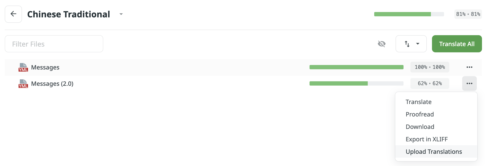

# 消息文件

消息文件的配置教程

`messages/` 文件夹包含许多语言的消息和翻译文件。所有内容均可翻译，包括命令、菜单与聊天栏消息。

插件使用的默认语言可以在 `config.yml` 中的 `default_language` 设置。如果有需要，玩家还可以输入 `/skills lang [语言]` 修改显示语言，`[语言]` 为配置文本的 `languages` 列表中的有效二字代码（也即 `messages_` 文件名称后的字符）。

## 编辑消息

编辑消息时切记：

* 颜色与样式为 MiniMessage 格式。但仍然兼容旧版的 Bukkit 颜色代码 `&`。
* 请勿修改 `{诸如此类}` 格式的任意消息变量。这些都会在显示时被插件解析为实际数据。
* 不要使用消息文件编辑菜单中的颜色或样式。这些完全可以在[菜单](menus.md)配置中完成。你只在修改消息的实际文本时才需要编辑菜单消息。
* `menus` 的消息、能力描述及其他消息会自动换行。无需手动插入换行符 `\n`。
* 请勿改动 `file_version` 设置。它用于标记消息文件版本，以便在更新时增加新的内容。

## YAML 格式提示

* **不要使用 TAB 制表符，**只有空格才能缩进。整个文件应当保持统一的 2 个空格缩进。
* 如果你的消息以 `&`、`{` 或 `}` 开头，**请将整条消息以英文双引号括起**（如 `"消息文本"`）。如果不确定，也请括起。

### 单位

所有变量 `{xp_unit}`、`{mana_unit}` 与 `{hp_unit}` 都会被替换为 `units` 部分的内容。这些变量可以在需要的时候被添加至任何消息中。

## 添加翻译

如果你的语言尚无译文，或你的语言中有错译的情况，你可以在 [Crowdin](https://crowdin.com/project/aureliumskills) 上进行检查。你可以直接逐个翻译消息，也可以直接上传译毕的消息文件。如果你的语言没有出现于此，你可以在 [Discord](https://discord.gg/Bh2EZfB) 上询问并要求添加。

若要上传消息文件，点击“上传翻译”。若要下载消息文件，请点击“下载”。

进度条中的蓝色部分表示翻译已存在但尚未通过开发者/校对者审查。这些译文仍然会包含在下载的文件中。

## 翻译准则

在 Crowdin 提交社区翻译前，请将如下准则牢记于心：

* 请勿修改原文本中的彩色代码，添加额外的彩色或样式标签。样式应当与 messages_en.yml 中的一致。
* 不要去除消息文本中的任何变量。
* 尽可能达意。译文不应影响描述与名称的意义。
* 请勿重复翻译；若需要更新，请将其添加至已有文件。
* 尽可能格式一致，如断句、颜色与大小写。你可能需要根据上下文/参数移动一些颜色标签的位置。

## 添加文件

为了添加原本不存在或未载入的消息文件，你必须将其加入 `config.yml` 下的 `lanaguge` 或 `default_language` 列表中。其必须对应有效的语言代码，即文件名 `message_` 后，`.yml` 前的内容。部分语言会在其代码后额外拥有一段地区代码，以 `-` 分隔。例如，巴西葡萄牙语的格式代码为 `pt-BR`。