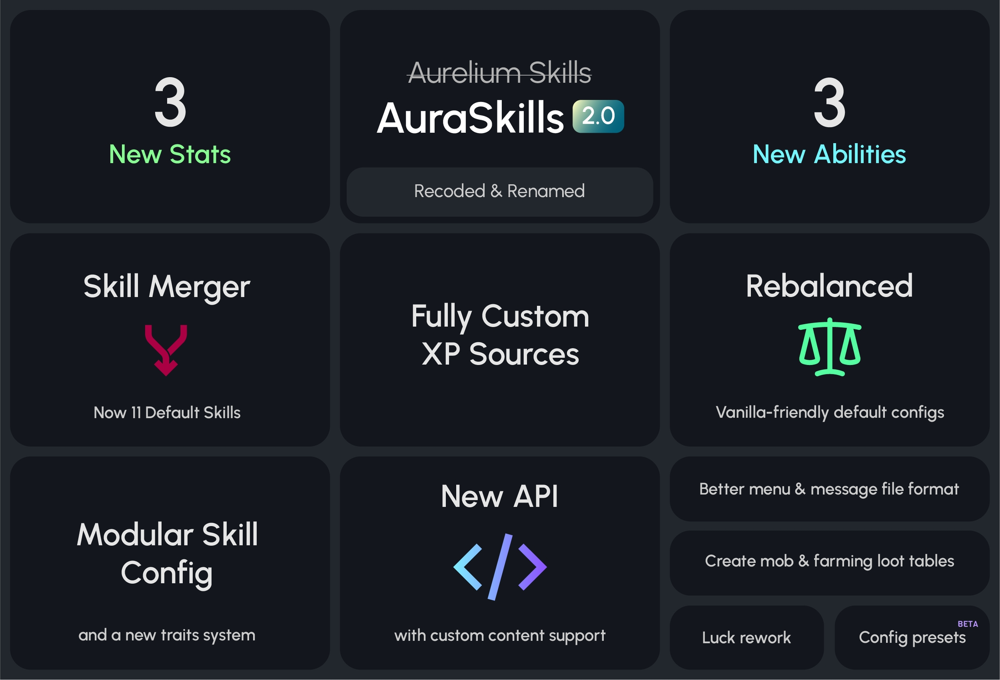

# 2.0

AuraSkills 2.0 更新日志

AuraSkills 2.0 对插件进行了完全重写，改写了已有系统，使其更加模块化与客制化。虽然大部分改动不明面显示，如配置结构改动与[新 API](api.md)，但是仍然有一些玩家可以享受的全新内容。默认配置也通过多次游玩测试，对内容与数值进行了简化与平衡，使其能更好地为原版生存体验增光增色。

::: warning

若你从 Beta 版本迁移而来，请务必阅读“[数据迁移](migration.md)”章节以了解重大改动！

:::

核心功能图解

## 新功能

### 自定义经验来源

经验来源使用了全新客制化的[配置格式](sources.md)。

* 配置各个技能经验来源的文件已移动至 `sources` 文件下并分别存储。
* 每个经验来源现在拥有指定类型与选项，可自由指定经验的收集。如，所有破坏方块的经验来源类型均为 `block`。
* 像默认来源一般加入了新的经验来源，类型选项可填入更多内容进行控制。
* 新版本配置可实现：
  * 破坏任意指定状态的方块获取经验值（兼容自定义方块）。
  * 从任意 Minecraft 统计数据获取经验值，如现存的跑步与行走经验来源。
  * 消耗指定物品获取经验值。
  * 附魔或酿造自定义物品获取经验值。
  * 渔获物为自定义物品时获取经验值。
* 经验来源不再与其默认技能绑定，可在技能之间自由切换。

### 模块化系统

添加了单独配置技能的 `skills.yml`。

* 能力与魔法能力不再与其默认技能绑定，可在技能之间自由切换。
* 自定义技能、能力与魔法能力可通过 [API](api.md) 无感添加。

### 新能力

* 新耕作能力：范围增生
  * 30 格内的作物加速生长。
  * 默认五级耕作解锁。
* 新箭术能力：箭矢回收
  * 一定范围外未命中的落地箭矢会自动回收。
  * 默认一级箭术解锁。
* 新战斗能力：招架
  * 受击后的一段时间内降低所受横扫伤害并免疫击退。
  * 默认一级战斗解锁。

### 新属性

暴击伤害、暴击率与速度现在为单独的属性。

* 旧的箭术暴击率与战斗暴击率能力已被替换为普通的属性奖励，以便增加新能力。
* 速度属性总是显示玩家实际速度，100 即 100%（正常）移速。技能默认不增加移速属性，你可以将其用在奖励或修饰符中。

### 特征

特征系统让属性更模块化与客制化。

* 特征代表着属性改动/强化机制。例如，智慧属性会增加获取的经验值，降低铁砧费用并增加魔力上限。这些内容现在被表示为单独的特征：experience_bouns、anvil_discount 与 max_mana。
* 特征可在属性间移动。
* 属性与特征都可通过一个选项开关，而无需移除每个属性奖励。
* 将特征链接至属性时，修饰符选项决定了每个属性等级可获得多少特征值。
* 当特征修饰符值为 1（即与属性数值等同）时可直接显示而无需以属性值代替之。这允许生命值属性可以在菜单内显示其实际数值，包括默认的 20 点生命与其他插件分配的生命值。

### 幸运属性重做

* 幸运属性完全重做，使其实用性进一步提升。与之前增加 Minecraft 原版的幸运属性不同的是，它现在会增加耕作幸运、伐树幸运、挖矿幸运、渔技幸运及采掘幸运的特征值。
* 这些特征会增加对应技能任意经验来源的额外物品掉落。
* 假设玩家的幸运特征值为 150，他们会额外获得 1 个掉落物，并有 50% 的几率再获得一个。
* 幸运特征也会受每个采集技能的特定能力影响，如“收获满满”。
* “三倍收获”耕作技能已被移除，因为“收获满满”技能的效果本身就是提升耕作幸运。

### 实体与耕作战利品表

* 自定义[战利品表](loot.md)现支持插入实体与农作物掉落。
* 创建 `loot/mob.yml`，通过 `mobs` 设置为任意种类实体添加掉落物。
* 任意带有方块经验来源的技能现在可单独设置自定义战利品表，包括耕作技能。只需创建与其英文原名对应的文件，如 `loot/farming.yml` 即可。

## 改动

### 插件改名

插件名称从 AureliumSkills 改为了 AuraSkills。这表示其存储数据的文件夹变为了 `plugins/AuraSkills`。

* 为什么？新名称更短更简洁，更有意味。原本的插件名称在制作之初并没有任何含义，且提及时名称总是很长。
* 对于与 AureliumSkills 联动的插件，此次更名意味着与 Beta 版本的兼容性不会被影响，开发者可浏览新的联动系统，以及新版的改进 [API](api.md)。插件将同时支持 Beta 与 2.0 版本。
* 新数据文件夹迁移更简单，无需覆盖已有文件。这表示迁移几乎不会出现问题。
* PlaceholderAPI 变量支持 `%auraskills_` 前缀。旧 `%aureliumskills_` 变量仍然会正常显示，但非常建议将其迁移至新版本格式。
* 所有权限都被更名并重制。旧权限将失效。见[权限列表](permissions.md)获取最新版本提供的所有权限。

### 技能更迭

部分技能升级过慢，能力并无许多作用，因此新版合并/移除了一些技能。这使得技能总数从 15 下降为了 11。现存的 15 个技能仍然可以通过旧版本预设使用，只需执行命令 `/skills preset load legacy.zip` 即可。

::: warning

如果你是从旧版迁移，旧版预设会自动生效，你仍然会有 15 个技能。如下内容不会生效。

:::

* “耐力”现在合并至“敏捷”。
* “治疗”现在合并至“炼药”。
* “锻造”现在合并至“附魔”。
* 移除技能（耐力、治疗、锻造）的经验来源也一并加入对应技能，因此经验获取方式不变。
* 实用性较强的两个技能被保留，剩下的则不包含在默认配置中。
* 没有删除任何能力，你可以通过 `skills.yml` 将其加回。
* “法术”技能因其没有任何能力而被移除。

### 配置格式

配置文件的格式与位置有较大改动。

* 所有 `config.yml`（[主配置文件](main-config.md)）现在使用下划线而非横杠。
* [技能配置](skills.md#配置)转移至 `skills.yml`。
* [属性配置](stats.md#配置)转移至 `stats.yml`。
* [能力配置](abilities.md#配置)转移至 `abilities.yml`。
* [魔法能力配置](mana-abilities.md#配置)转移至 `mana_abilities.yml`。
* [经验来源配置](sources.md)转移至 `sources` 文件夹下。

### 消息格式

* `menus` 部分的消息文件，与技能、属性与能力描述不再包含格式符。样式现在完全交由菜单配置处理。
* 旧版颜色字符 `&` 被替换为 [MiniMessages](https://docs.advntr.dev/minimessage/format.html) 标签。旧格式仍会生效。
* 删除了大部分消息中的换行符（\n），新版本通过描述折行解决了这一问题。
* 每种语言都相同的消息被移动至 `messages/global.yml` 文件中。
* 因为能力可在技能下任意移动，每个能力配置现在位于 `abilities` 文件夹下而非每个技能各占一块配置区域。
* 删除了方块与实体名称的消息，新版本的此类消息可自动跟随客户端使用的语言而显示。这让配置文件大小缩减了近 200 行。

### 菜单格式

* 旧版颜色字符 `&` 被替换为 [MiniMessages](https://docs.advntr.dev/minimessage/format.html) 标签。旧格式仍会生效。
* 添加了菜单组件，即插入描述中的某些模板。这允许元素在保持格式不变的情况下按条件显示或隐藏。
* 添加了 `formats` 部分，用于决定部分物品的格式。大部分已被移动至消息文件。
* 添加了不同的描述行样式，并添加了自动折行功能。当前行的样式/颜色不会因折行而改变。
* 添加了组，允许情境通过菜单顺序决定而非静态位置。这使得物品可以在其中一个条目被移除/添加时移动而无需修改位置。组可设置为中心、靠左或靠右对齐。
* 直接从消息文件替换的变量格式变为 `{{如此}}`。对应格式的消息可直接按 `menus.菜单名称.路径` 或 `menus.common.this` 的路径找到，其中 `菜单名称` 即为变量所在的菜单名称，`路径` 即为双重花括号内的文本。这些改动意味着你可以任意引用消息文件内的内容，包括自行添加的新内容。
* 单花括号变量为插件直接替换的数据变量，通常为数字。
* 模板的情境部分现在位于 `contexts` 部分而非直接位于其下。
* `level_pregression` 下的 `unlocked`、`locked` 与 `in_progress` 模板情境从 `1-items_per_page` 变为了 `1-max_level`。这使得修改指定等级的材料从而标明某级的特殊奖励成为可能。

### 菜单外观

默认菜单的外观进行了微调。

* 在 skill、in_progress、level_progress 模板中添加了经验进度条。
* 在默认的 11 个技能样式中，三个战斗技能现在位于第一行，五个采集技能则位于第二行。“敏捷”技能被移动至第三行。
* 所有技能物品上的战利品/盔甲都改为了对应的铁质物品。
* your_skills 物品现在为玩家头颅。

### 默认配置

如下为默认配置的改动。如果你从 Beta 迁移，这些设置不会生效。

#### 主配置改动

* 在主配置中加入了一个 `start_level` 选项来决定玩家的起始等级。**玩家的默认等级现在为 0，而非先前的 1。**
* `boss_bar.mode` 的值变为 `single`。
* `enable_roman_numerals` 的值变为 `false`。
* 添加了配置伤害指示器暴击状态的颜色；默认的 `damage_holograms.colors.critical.digits` 由一开始的灰色变为现在的白色。
* `auto_save.enabled` 的值变为 `true`。

#### 技能改动

* 技能等级最大为 100 而非先前的 97。
* 部分技能对应能力因技能合并而有所改变。

#### 属性改动

* 生命值倍率现在为 1，这样属性就会与 Minecraft 的生命值属性相符。奖励文件的生命属性奖励为配合此变动而改为 0.4。这表示玩家每次升级会 +0.4 生命值上限，比 ActionBar 更精确。
* 因可能获取的生命值上限减少，生命值特征中的 `hearts` 选项现在会显示更多心。
* 魔法再生速度大幅下降，使得魔法技能消耗更大（0.1 变为 0.02）。
* 力量属性修饰符从 0.5 下调至 0.4。
* 部分特征的修饰符按照现存的属性修饰符值进行了不同的调整。
* 基础魔力再生从 1 下调至 0.1。
* 不再允许溢出魔力（超出上限的魔力值）。

### 物品 NBT 格式

物品/装备修饰符、条件及倍率存储在物品上的格式发生了变化。

* 新格式使用了内置的 PersistentDataContainer API 而非外部库的 NMS 代码。
* 手持旧物品会自动将其转化为新格式。

### 伤害

* 大部分除力量外的伤害属性修饰符都从乘积计算变为了叠加计算。
* 这表示暴击伤害、“工具大师”能力与“先出之刃”能力在伤害翻倍前会叠加计算。

## 技术性改动

### 代码结构

代码仓库已被分为多个模块，使得 API 独立实现，并能让其他平台如 Folia 或 Fabric 的兼容更为容易（不保证）。

* `api` - 包含不依赖 Bukkit API 的 API 代码。
* `api-bukkit` - 包含依赖 Bukkit API 的 API 代码，如事件。在使用 `api-bukkit` 依赖时，所有 `api` 模块内的代码都包含在内。
* `bukkit` - 包含需要 Bukkit API 的代码实现，如经验来源、能力、特征、战利品、命令与菜单等。
* `common` - 包含不依赖 Bukkit API 的核心技能系统，包括注册条目、大部分载入的配置、消息、奖励、迁移、玩家管理与数据存储等。

插件包名从 `com.archyx.aureliumskills` 更改为 `dev.aurelium.auraskills`。

## API

> 主条目：[API](api.md)

2.0 更新添加了全新的 API，能力与拓展性更强。它也支持添加自定义内容（技能、属性、能力等）。

## 证书

插件现在基于 [GPLv3](https://www.gnu.org/licenses/gpl-3.0.en.html) 证书发布。这意味着发布了本插件修改后版本或分支的作者也必须公开其源代码。