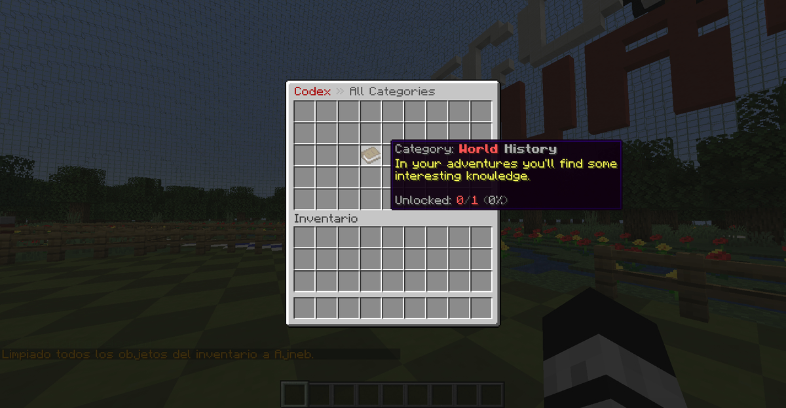
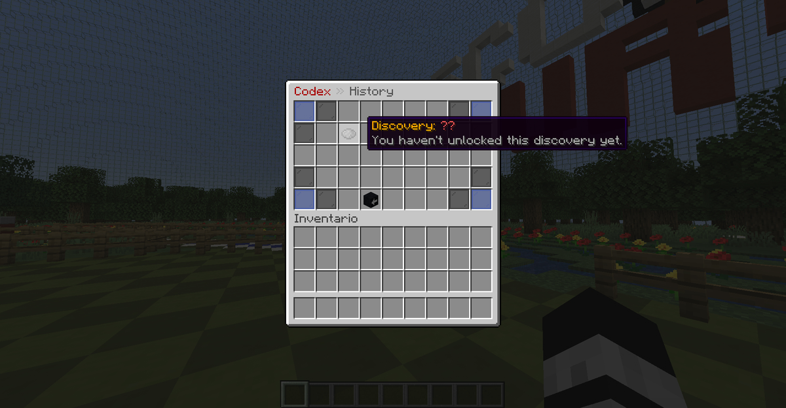

# GUI 教程

在我的插件中，你可以完全自定义插件的 GUI 显示内容，但这会略微复杂一些！接下来我将为你展示一个带有一个分类的简单示例菜单。
``` YAML
Inventories:
  main:
    slots: 45
    title: '&4Codex &7» &8All Categories'
    '21':
      type: history
      item: BOOK
      name: '&7Category: %name%'
      lore:
      - '&eIn your adventures you''ll find some'
      - '&einteresting knowledge.'
      - ''
      - '&7Unlocked: %unlocked% &8[%progress_bar%&8] &8(&7%percentage%&8)'
      open_inventory: history_discoveries
  history_discoveries:
    slots: 45
    title: '&4Codex &7» &8History'
    '11':
      type: history;1
      item: PAPER
      name: '&6Discovery: %name%'
      lore:
      - '%lore%'
    '39':
      skull_data: eyJ0ZXh0dXJlcyI6eyJTS0lOIjp7InVybCI6Imh0dHA6Ly90ZXh0dXJlcy5taW5lY3JhZnQubmV0L3RleHR1cmUvMzdhZWU5YTc1YmYwZGY3ODk3MTgzMDE1Y2NhMGIyYTdkNzU1YzYzMzg4ZmYwMTc1MmQ1ZjQ0MTlmYzY0NSJ9fX0=
      name: '&7Go Back'
      open_inventory: main
    0;8;36;44:
      item: BLUE_STAINED_GLASS_PANE
      name: ' '
    1;7;9;17;27;35;37;43:
      item: BLACK_STAINED_GLASS_PANE
      name: ' '
```
你总是会需要修改“main”分支下的大部分内容，这些代表着这个插件显示的主GUI内容，也就是输入 `/codex` 命令时打开的GUI所包含的内容。在这里你可以通过设置内容相同部分的槽位序号来决定它们在GUI中实际显示的物品样式。

如果一个物品代表一个图鉴的分类，那么你就需要为其设置种类参数，以及定义此分类的名称（这一部分在文件名上修改即可）。
这将会允许你使用例如下面一系列的内建变量：

**%name%** 此分类的名称    
**%unlocked%** 剩余未解锁物品数量    
**%percentage%** 此分类图鉴完成度百分比    
**%progress_bar%** 此分类图鉴完成度进度条


你可以添加 `open_inventory` 选项以在玩家点击时打开另一个已经存在的 GUI 菜单。那么，在主菜单中将会有一个位于 21 号格子的物品，点击这个物品将会打开 `history_discovery` 菜单。而在这个菜单中又会有一个在 39 号格子的物品允许玩家在点击后返回主菜单。

若你想要一个物品代表一个可发现物图鉴而不是一个图鉴里的分类，你需要在 type 选项中添加参数，这次你需要在这个分类名称后加上 `;` （英文分号），然后是这个图鉴的名字。这会允许你使用一些内建变量： **%name%** （此图鉴的名称）**%lore%** （此图鉴的描述）

这是两张示例配置在游戏中的显示效果：




## GUI 菜单选项

|设置|描述|
|---|---|
|**slots:** 45|打开此菜单的按钮所在的位置。请使用下列数字：<br>9, 18, 27, 36, 45, 54|
|**title:** "&4Codex &7» &8All Categories"|此菜单的名称。|
|**3<br>21<br>26;27;28**|在这个位置使用数字来代表物品在这个菜单中的格子位置。你也可以在同一区域下使用多个格子来达到多个位置显示同一物品的效果。|

## 物品选项

|设置|描述|
|---|---|
|**type:** regions<br>**type:** regions;1|如果此物品代表一个图鉴的分类或一个新的图鉴，那么你就会用到这个格式。<br>图鉴分类使用下列参数：<br>`type: 分类名称`<br>单独图鉴使用下列参数：<br>`type: 分类名称;图鉴名称`|
|**item:** BOOK|物品的样式。物品名称参考此处：<br>https://hub.spigotmc.org/javadocs/spigot/org/bukkit/Material.html （最新版本）<br>https://github.com/Attano/Spigot-1.8/blob/master/org/bukkit/Material.java （1.8 版本）|
|**name:** "&7Category: %name%"|物品的名称。你可以使用内建变量 `%name%` 来显示这个分类或独立图鉴的名称。|
|**lore:**<br>-"&eIn your adventures you'll find"<br>-"&esome interesting knowledge."<br>-""<br>-"&7Unlocked: %unlocked% &8(&7%percentage%&8)"|物品的描述。你可以在这里使用内建变量 `%unlocked%` 和 `%percentage%`。你也可以使用 PlaceholderAPI 变量。|
|**custom_model_data:** 1|物品的自定义模型数据值。若想要添加可在此自定义。|**open_inventory:**|如果你想要在点击这个物品时打开另一个菜单，你可以添加这个可选选项。<br>若你需要关闭这个菜单，那么需要使用这个格式：<br>`open_inventory: close`|
|**skull_data:** eyJ0ZXh0dXJlcyI6eyJTS0lOIjp7In(...)|若你要在这个格子使用自定义头颅材质，添加这个参数并填入与之配合的头颅 Base64 值。在 https://minecraft-heads.com/ 你可以找到大多数的自定义头颅，你需要在这里填入的字段是这个网页中显示头颅信息的 'Value' （译者注：通常是一串 Base64 代码）|
|**click_commands:**<br>-"msg %player% &fHello"<br>-"eco give %player% 5"|当你想要玩家在点击这个物品时执行特定命令，那么你就需要用到这个选项。如果这个物品代表着一个本插件的图鉴或分类图鉴，那么玩家需要先解锁这个图鉴才可以使用这个按钮。<br>若你需要以玩家身份执行一个命令，你可以使用下面这个参数：<br>`"player_command: 执行的命令"`|