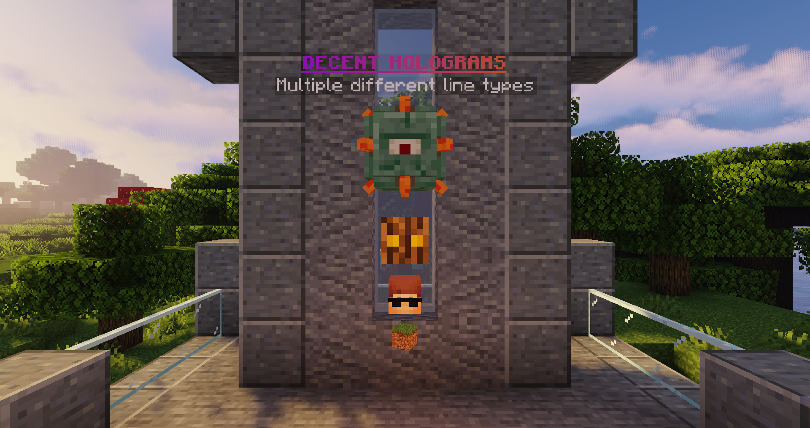

# :fas fa-save: 格式与颜色
悬浮字行内容的通用格式说明。

DecentHolograms 能显示的东西不只是文本，通过特定的格式，你可以在悬浮字中展示悬浮物品、穿戴在（小）盔甲架的头部的物品、甚至是实体。




> [!NOTE|label:变量]
> 来自 PlaceholderAPI 和插件内置的变量可以在文本和其他类型的悬浮字行中展示。    
> 示例：除了玩家名称，你还可以使用 `{player}` 来将悬浮字中的玩家头颅替换成看向它的玩家头颅。

## 文本

这是 DecentHolograms 使用的默认悬浮字行类型。只有在按照特定格式（见下）的悬浮字文本才会显示为其他内容。

<!-- tabs:start -->

#### **格式**

```
<text>
```

#### **示例**

```
&a这是普通的&f&l一行文本&a!
```

<!-- tabs:end -->


## `#ICON: <物品>`

在悬浮字中展示一个物品。
需要注意的是，物品会持续转动，且无法被插件禁用。
若你想要不移动的物品，请使用 [`#HEAD`](#head-物品) 或 [`#SMALLHEAD`](#smallhead-物品) 类型。

<!-- tabs:start -->

#### **格式**

```
#ICON: <材料名>[:<数据值>] [选项]
```

* `[:<数据值>]` 仅在 1.13 前有效，`<数据值>` 是物品使用的数据值。需要注意的是**不**需要带上 `[ ]` 符号。

* `[选项]` 可以被下列这些内容替代（可结合使用！）：
    * `(<值>)` 其中的 `<值>` 可以是在本章节[玩家头颅]部分讲到的任何选项。这里的 `()` 不能省略！
    * `{<NBT>}` 其中的 `<NBT>` 为任何有效的 NBT 数据（如 `CustomModelData:1`）。这里的 `{}` 不能省略！

#### **示例**

```
/// 红色羊毛（仅在 1.13 前的版本有效）
#ICON: WOOL:14

/// 淡蓝色皮革盔甲
#ICON: LEATHER_CHESTPLATE {display:{color:3847130}}

/// d0by 的玩家头颅（若为低于 1.13 的版本，请替换为 SKULL_ITEM）
#ICON: PLAYER_HEAD (d0by)
```

<!-- tabs:end -->

## `#HEAD: <物品>`

头颅行将会显示为与正常盔甲头盔部分穿戴内容大小一致的物品。
以这种方式显示的物品不会旋转，但可能与悬浮字中心有一定偏移。

<!-- tabs:start -->

#### **格式**

```
#HEAD: <物品>[:<数据值>] [选项]
```

* `[:<数据值>]` 仅在 1.13 前有效，`<数据值>` 是物品使用的数据值。需要注意的是**不**需要带上 `[ ]` 符号。

* `[选项]` 可以被下列这些内容替代（可结合使用！）：
    * `(<值>)` 其中的 `<值>` 可以是在本章节[玩家头颅]部分讲到的任何选项。这里的 `()` 不能省略！
    * `{<NBT>}` 其中的 `<NBT>` 为任何有效的 NBT 数据（如 `CustomModelData:1`）。这里的 `{}` 不能省略！

#### **示例**

```
// d0by的头（若为低于 1.13 的版本，请替换为 SKULL_ITEM）
#HEAD: PLAYER_HEAD (d0by)
// 草方块
#HEAD: GRASS_BLOCK
```

<!-- tabs:end -->

### `#SMALLHEAD: <物品>`

将物品/方块以装备在小盔甲架头部上的样式显示。
以这种方式显示的物品不会旋转，但可能与悬浮字中心有一定偏移。

<!-- tabs:start -->

#### **格式**

```
#SMALLHEAD: <物品>[:<数据值>] [选项]
```

* `[:<数据值>]` 仅在 1.13 前有效，`<数据值>` 是物品使用的数据值。需要注意的是**不**需要带上 `[ ]` 符号。

* `[选项]` 可以被下列这些内容替代（可结合使用！）：
    * `(<值>)` 其中的 `<值>` 可以是在本章节[玩家头颅](#玩家头颅材质)部分讲到的任何选项。这里的 `()` 不能省略！
    * `{<NBT>}` 其中的 `<NBT>` 为任何有效的 NBT 数据（如 `CustomModelData:1`）。这里的 `{}` 不能省略！

#### **示例**

```
// d0by的头（若为低于 1.13 的版本，请替换为 SKULL_ITEM）
#SMALLHEAD: PLAYER_HEAD (d0by)
// 草方块
#SMALLHEAD: GRASS_BLOCK
```

<!-- tabs:end -->

## `#ENTITY: <实体>`

展示实体。可展示的实体列表在[这里](https://hub.spigotmc.org/javadocs/bukkit/org/bukkit/entity/EntityType.html)查询

> [!NOTE|label:提示]
> * 实体显示位置固定。不可被修改。
> * 部分实体不能在悬浮字中使用。完整列表[见此](https://github.com/DecentSoftware-eu/DecentHolograms/blob/f28df4373f4d56e17eb33005885222f726ac1350/src/main/java/eu/decentsoftware/holograms/api/utils/entity/DecentEntityType.java#L21-L51)（最后更新：2024 年 4 月 27 日）


<!-- tabs:start -->

#### **格式**

```
#ENTITY: <实体>
```

#### **示例**

```
#ENTITY: PIG
#ENTITY: AXOLOTL
```

<!-- tabs:end -->

## 附加信息

### 限定版本的实体与物品

你只能使用当前 Minecraft 服务器版本存在的实体与物品。除此之外版本之间的同种物品/实体可能会因 Mojang 的改动而略有差异。
例如，1.20.4 之后，`GRASS`（普通的草）被重命名为了 `SHORT_GRASS`，因此在 1.20.4 版本你应该使用 `GRASS`，在之后的版本应当使用 `SHORT_GRASS`。

### 玩家头颅材质

下列选项可以填入 `(<值>)` 中的 `<值>` 参数中：

* 玩家名称（如 `d0by`）。
* 解析为玩家名称的变量，如 `{player}`。这将会在悬浮字中显示对应玩家设置皮肤的头颅。
* Base64 编码的材质字符串。你可以在 https://minecraft-heads.com/ 中找到这些值，它们一般被称作“值（value）”。
* `HEADDATABASE_<id>` 为来自于 https://minecraft-heads.com/ 的数字（需要安装 [HeadDatabase](https://www.spigotmc.org/resources/14280/) 插件）。