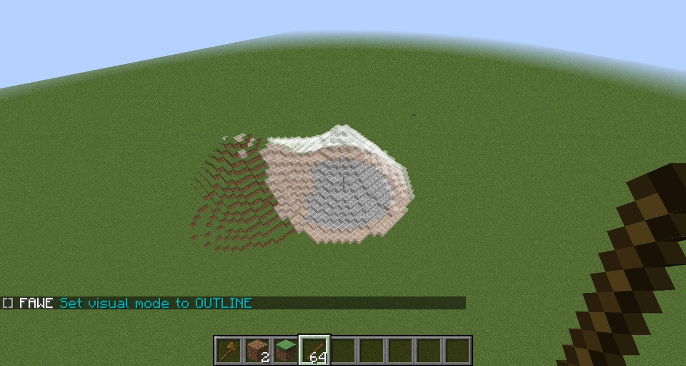

# 笔刷

## 介绍

FAWE 中的笔刷工具允许你在视角远处放置、“涂抹”方块。启用笔刷后，其会自动绑定至手持物品。你可以为不同物品绑定同一笔刷，且单个物品至多绑定两个笔刷。

## 装备笔刷

* 绑定至任意点击触发：`/br <笔刷>`
* 绑定至右键触发：`/br primary <笔刷>`
* 绑定至左键触发：`/br secondary <笔刷>`

### 修改笔刷设置

* [`/mat <图案>`](https://github.com/IntellectualSites/documentation/blob/main/fastasyncworldedit/patterns/patterns.md) - 决定放置的图案内容
* [`/mask <蒙版>`](https://github.com/IntellectualSites/documentation/blob/main/fastasyncworldedit/masks/masks.md#_masks) - 决定方块是否可被改变的蒙版
* [`/smask <蒙版>`](https://github.com/IntellectualSites/documentation/blob/main/fastasyncworldedit/masks/masks.md#_smask_masks_) - 决定方块是否可被放置的源蒙版
* [`/targetmask <蒙版>`](https://github.com/IntellectualSites/documentation/blob/main/fastasyncworldedit/masks/masks.md) - 决定笔刷应用的方块类型。默认为 `!air`，即非空气方块。
* [`/transform <变形>`](https://github.com/IntellectualSites/documentation/blob/main/fastasyncworldedit/transforms/transforms.md) - 决定方块放置位置的变形参数。
* `/range <范围>` - 设置笔刷可使用的最大距离。
* `/size <大小>`- 设置笔刷的大小（如 10 格直径的球体）
* `/none` - 解绑工具，输入 `-h` 表示禁用副手绑定的笔刷工具。

### 修改笔刷目标

你可以修改目标模式，以便修改不同区域的建筑（空气、墙壁、地面等）。通过命令 `//brush range` 修改笔刷半径也很有用。

`/br target <0-3>`

* 0 = 目标方块
* 1 = 以视角为目标点
* 2 = 以当前位置所在最近的地面为目标点
* 3 = 方块面

### 添加笔刷行为

通过滚轮修改笔刷行为。

* `/br scroll clipboard <文件|文件夹|链接>`
* `/br scroll mask <蒙版1> <蒙版2...>`
* `/br scroll pattern <材料名1> <材料名2...>`
* `/br scroll range`
* `/br scroll size`
* `/br scroll target`

### 重置笔刷

蹲下（按住 `shift` 键）点击即可重置笔刷。
以剪贴板笔刷为例，这会清空笔刷的内容；以曲线笔刷为例，这会重置其中设置的点位。

### 显示笔刷（尚未实现）

安装 FAWE 的情况下，你可以预览笔刷修改方块后的样式：`/br vis <0-2>`

* 0 = 不显示
* 1 = 单点显示
* 2 = 显示所有改动的方块

### 笔刷列表

[可用笔刷请见命令章节。](command-utilties.brushes.md)