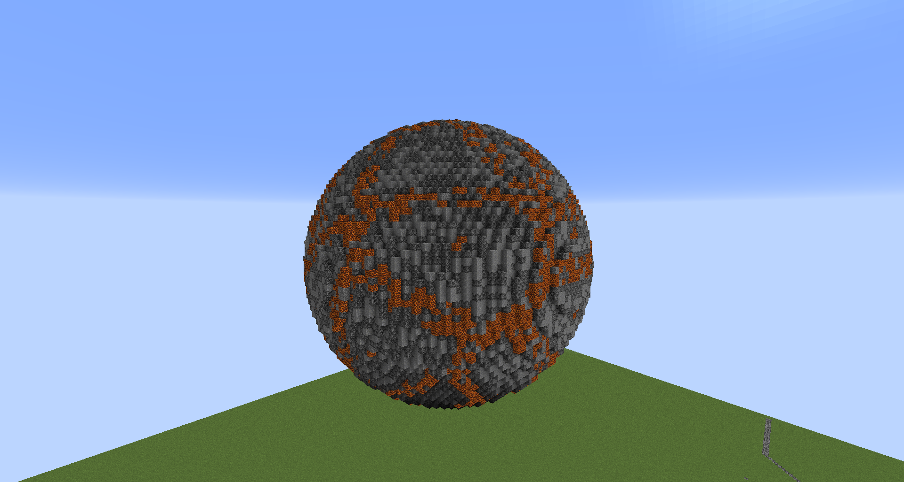
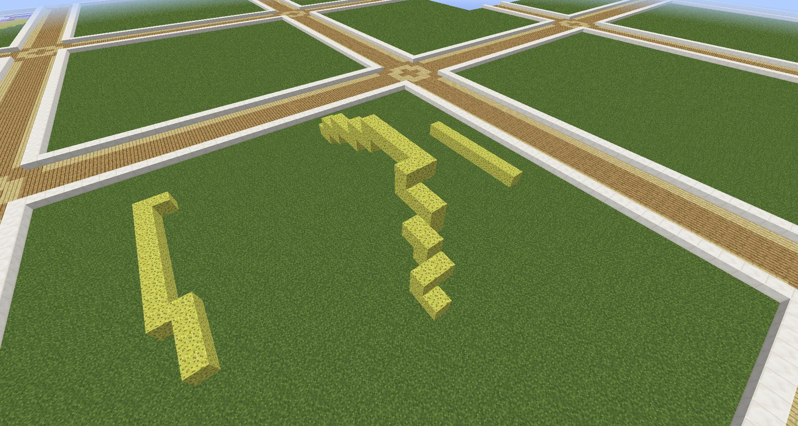
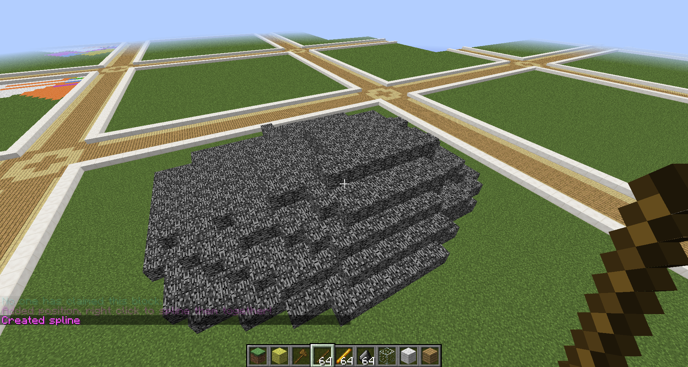
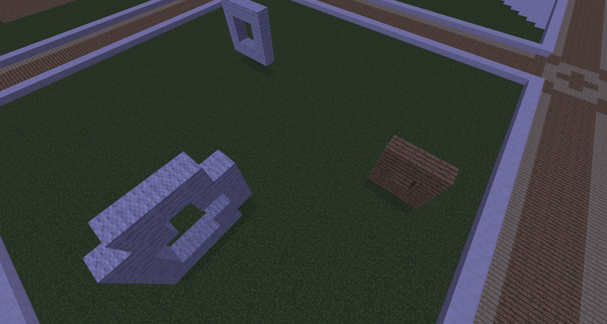
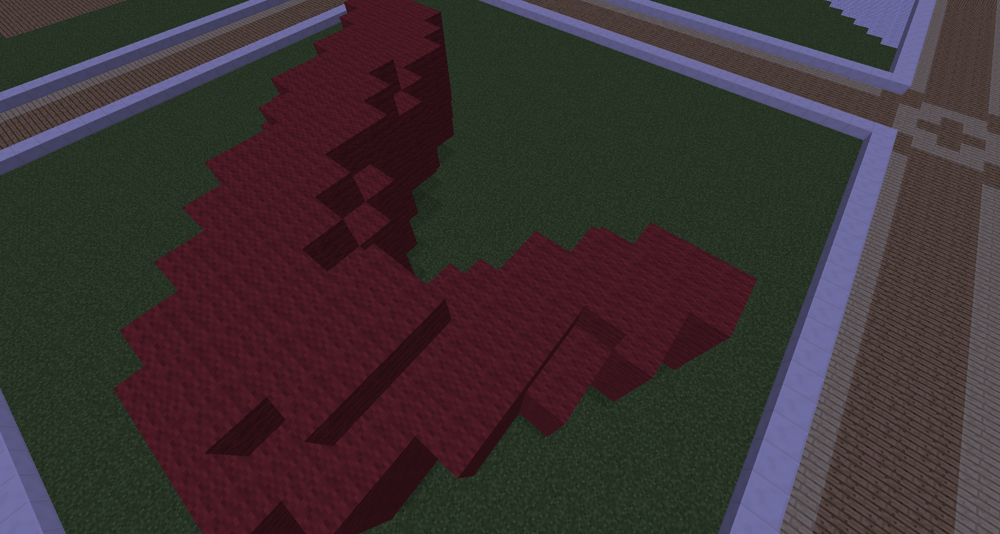
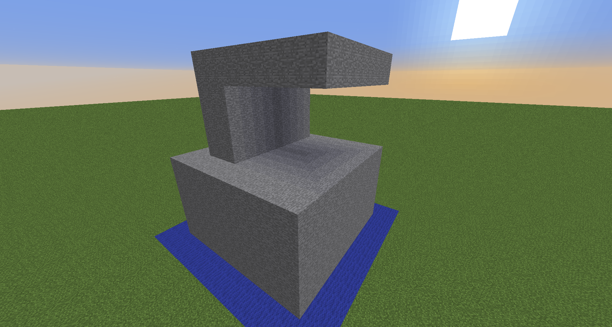
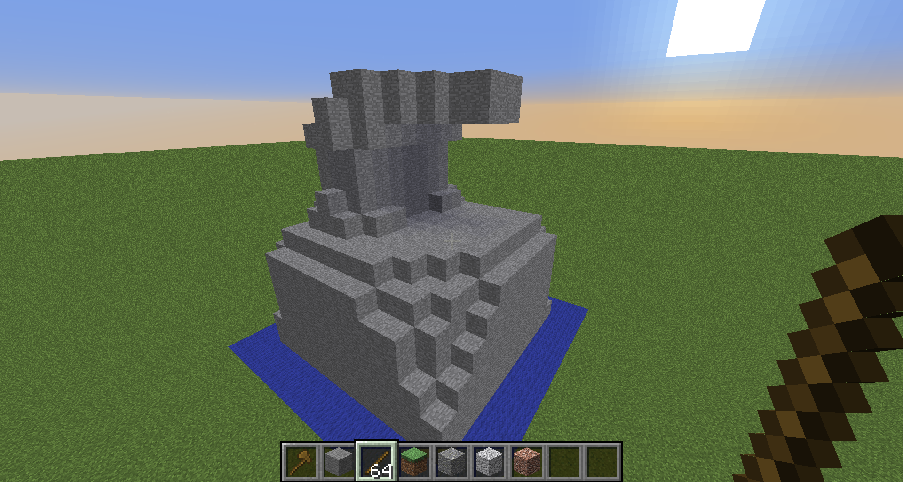
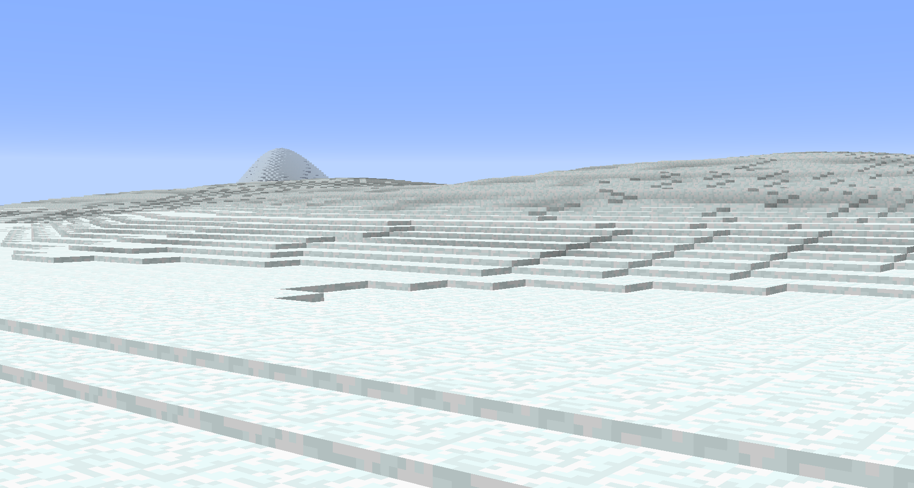
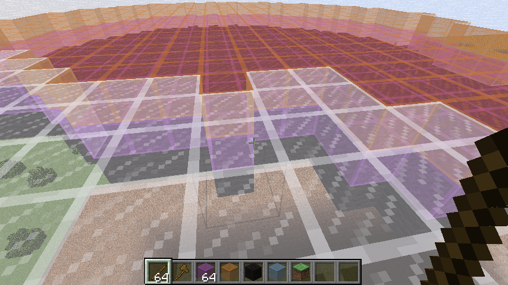
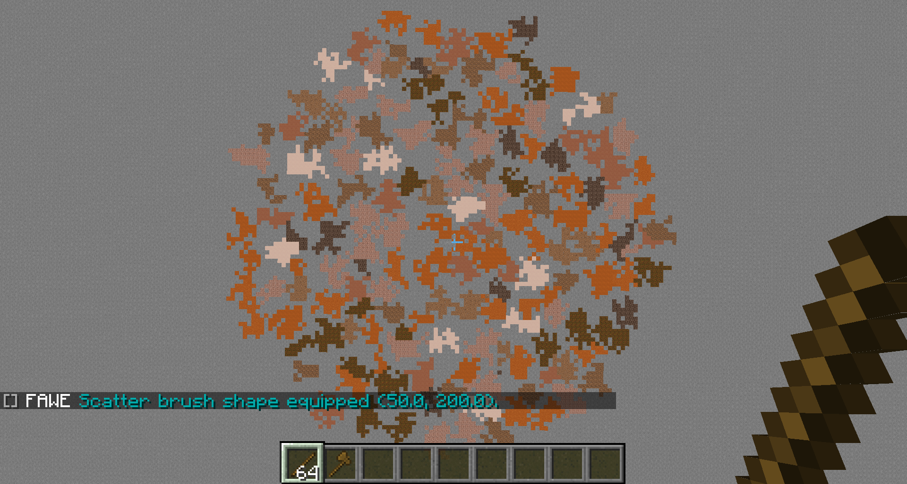

# 命令概览

## 介绍

若要在游戏内浏览帮助命令，请使用 `//help [分类|命令]`

## 命令格式

* `\<参数\>` - 必填参数
* `[参数]` - 选填参数
* `\<参数 1|参数 2\>` - 多选一必填参数
* `\<参数=默认值\>` - 带默认或推荐值的必填参数
* `-a` - 命令标志，如 `//\<命令\> -a [标志值]`

另见：

* [生物群系](https://github.com/IntellectualSites/documentation/blob/main/fastasyncworldedit/commands/biomes.md)
* [笔刷](command-utilties.brushes.md)
* [地形](https://github.com/IntellectualSites/documentation/blob/main/fastasyncworldedit/commands/geometry.md)
* [自然](https://github.com/IntellectualSites/documentation/blob/main/fastasyncworldedit/commands/nature.md)
* [导航](https://github.com/IntellectualSites/documentation/blob/main/fastasyncworldedit/commands/navigation/navigation.md)
* [选区](https://github.com/IntellectualSites/documentation/blob/main/fastasyncworldedit/commands/selection/selection.md)
* [蒙版](command-utilties.masks.md)
* [图案](command-utilties.patterns.md)
* [变形](command-utilties.transforms.md)

## 内容

点击分类可转至对应命令，`更多信息` 会附带更详细的描述。

* [WorldEdit 命令](#worldedit-命令) - 更新、信息、调试与帮助命令。
* [实用命令](#实用命令) - 多条实用命令。
* [区域命令](#区域命令) - 对区域进行操作的命令。
* [选区命令](#选区命令) - 修改选区角点，选择模式或显示选区信息。
* [历史命令](#选区命令) - 撤销、重做及清理历史相关命令。
* [结构命令](#结构命令) - 用于处理结构文件相关的命令。
* [剪贴板命令](#剪贴板命令) - 用于复制粘贴方块相关功能的命令。
* [生成命令](#生成命令) - 创建结构与地物的命令。
* [群系命令](#群系命令) - 修改、列出或查询生物群系等相关命令。
* [超级镐子命令](#超级镐子命令) - 超级镐子相关命令。
* [导航命令](#导航命令) - 移动玩家的相关命令。
* [快照命令](#快照命令) - 列出、载入或查询快照等相关命令。
* [脚本命令](#脚本命令) - 执行脚本。
* [区块命令](#区块命令) - 检查区块。
* [选项命令](#选项命令) - 切换玩家、设置及物品信息。
* [笔刷选项命令](#笔刷选项命令) - 工具命令。
* [工具命令](#工具命令) - 将功能绑定至手持物品。
* [笔刷命令](#笔刷命令) - 远程建筑与绘方块的相关命令。
* [/masks](#蒙版命令masks) - 多种蒙版的帮助。
* [/patterns](#图案命令patterns) - 多种图案的帮助。
* [/transforms](#变形命令tranforms) - 多种变形的帮助。
* [图生结构](#图生结构尚未支持) - 通过图像生成世界，尚未实现。

### 未分类

|别称|权限|标志|用法|
|---|---|---|---|
|`//cancel`|`fawe.cancel`|无|取消当前操作|
|`/plot replaceall`|`plots.replaceall`|无|替换地皮世界内的所有方块|

### WorldEdit 命令

更新、信息、调试与帮助命令。

#### /we threads

*权限：* `worldedit.threads`\
*描述：* 显示所有线程堆栈。

#### /we version

*描述：* 显示 WorldEdit/FAWE 版本

#### /we help [命令]

*权限；* `worldedit.help`\
*描述：* 显示 FAWE 命令帮助。

#### /we reload

*权限：* `worldedit.reload`\
*描述：* 重载插件配置

#### /we cui

*描述：* 完成 CUI 握手请求（内部用法）

#### /fawe debugpaste

*权限：* `worldedit.debugpaste`
*描述：* 将调试信息上传至 https://athion.net/ISPaster/paste

#### /we tz [时区]

*描述：* 设置快照时区。

### 实用命令

多条实用命令。

#### /remove \<类型\> \<半径\>

*权限：* `worldedit.remove`\
*描述：* 移除指定类型的实体。

#### //fill \<图案\> \<半径\> [深度] [方向]

*权限：* `worldedit.fill`\
*描述：* 填充洞穴。

#### //help [命令]

*描述：* 显示 WorldEdit 帮助命令。

#### //drain \<半径\>

*权限：* `worldedit.drain`
*描述：* 抽干一定范围内的水。

#### /transforms [页码=1|搜索词|变形]

*权限：* `worldedit.transforms`\
*描述：* 修改方块放置的方式。

* 英文方括号 `[]` 表示参数
* 英文逗号 `,` 表示“或”多选
* 英文与号 `&` 表示“与”多选

#### //removenear \<方块\> [大小]

*权限：* `worldedit.removenear`\
*描述：* 移除附近方块。

#### //fixlava \<半径\>

*权限：* `worldedit.fixlava`\
*描述：* 将区域内的流动岩浆替换为静态岩浆源。

#### //removeabove [大小] [高度]

*权限：* `worldedit.removeabove`\
*描述：* 移除头顶的方块。

#### /masks [页码=1|搜索词|蒙版]

*权限：* `worldedit.masks`
*描述：* 决定方块是否能被放置。

* 英文方括号 `[]` 表示参数
* 英文逗号 `,` 表示“或”多选
* 英文与号 `&` 表示“与”多选

示例：`\>[stone,dirt],#light[0][5],$jungle`

#### //fillr \<图案\> \<半径\> [深度]

*权限：* `worldedit.fill.recursive`\
*描述：* 递归填充坑洞。

#### /patterns [页码=1|搜索词|图案]

*权限：* `worldedit.patterns`\
*描述：* 图案决定放置的方块

* 英文方括号 `[]` 表示参数
* 英文逗号 `,` 表示“或”多选

示例：`#surfacespread[10][#existing],andesite`

#### //replacenear \<大小\> \<目标 ID\> \<替换方块 ID\> [-f]

*权限：* `worldedit.replacenear`\
*描述：* 替换附近的方块

#### //snow [半径]

*权限：* `worldedit.snow`\
*描述：* 模拟降雪。

#### //thaw [半径]

*权限：* `worldedit.thaw`\
*描述：* 消融区域内的冰与雪。

#### //removebelow [大小] [高度]

*权限：* `worldedit.removebelow`\
*描述：* 移除你下方的方块。

#### //fixwater \<半径\>

*权限：* `worldedit.fixwater`\
*描述：* 将区域内的流动水替换为静态水源。

#### /butcher [半径] [-p] [-l] [-a] [-n] [-g] [-b] [-t] [-f] [-r]

*权限：* `worldedit.butcher`\
*描述：* 击杀一定范围内的实体，不填参数则使用配置中的默认值。

标志列表：

* -p 击杀宠物。
* -n 击杀 NPC。
* -g 击杀傀儡类生物。
* -a 击杀动物。
* -b 击杀被动生物。
* -t 击杀命名生物。
* -f 表示如上所有生物。
* -r 击杀盔甲架。
* -l 目前并无效果。

#### //confirm

*权限：* `fawe.confirm`\
*描述：* 确认命令操作

#### //green [半径] [-f]

*权限：* `worldedit.green`\
*描述：* 绿化周围区域

#### //calc \<表达式\>

*权限：* `worldedit.calc`\
*描述：* 计算数学表达式

#### //ex [半径]

*权限：* `worldedit.extinguish`\
*描述：* 熄灭附近的火

#### /heightmapinterface

*权限：* `fawe.admin`\
*描述：* 生成高度图界面。

### 区域命令

**基于区域的命令**

#### //replace [目标蒙版] \<替换图案\> [-f]

*权限：* `worldedit.region.replace`\
*描述：* 将选区内指定方块替换为其他方块

#### //stack [数量] [方位] [-s] [-a] [-m]

*权限：* `worldedit.region.stack`\
*描述：* 在指定方位上重复放置选区的内容。

标志列表：
* -s 将选区移动至最后重复放置的区域
* -a 忽略空气方块

#### //set [图案]

*权限：* `worldedit.region.set`\
*描述：* 将选区内方块设置为指定内容

#### //fall [替换] [-m]

*权限：* `worldedit.region.fall`\
*描述：* 让选区内方块坠落。\
-m 标志会让坠落方块以选区为边界。

#### //faces \<图案\>

*权限：* `worldedit.region.faces`\
*描述：* 在选区内筑墙、建造天花板或地板。

#### //hollow [\<厚度\>[ \<图案\>]]

*权限：* `worldedit.region.hollow`\
*描述：* 掏空选区内的物体。可选将被掏空部分替换为其他指定方块。厚度以曼哈顿距离计。

#### //center \<图案\>

*权限：* `worldedit.region.center`\
*描述：* 在选区中心放置方块。

#### //setskylight

*权限：* `worldedit.light.set`\
*描述：* 设置选区内的天空光照。

#### //nbtinfo

*权限：* `worldedit.nbtinfo`\
*描述：* 浏览指定方块的 NBT 信息。

#### //setblocklight

*权限：* `worldedit.light.set`\
*描述：* 设置选区内的方块光照。

#### //curve \<图案\> [厚度] [-h]

*权限：* `worldedit.region.curve`\
*描述：* 通过选定点位绘制曲线。

只能用在凸多面体选区内。

标志列表：
* -h 表示只生成外壳

#### //overlay \<图案\>

*权限：* `worldedit.region.overlay`\
*描述：* 在选区内的方块顶部覆盖一层方块。

#### //lay \<图案\>

*权限：* `worldedit.region.overlay`\
*描述：* 替换选区内上表面的方块。

#### //naturalize

*权限：* `worldedit.region.naturalize`\
*描述：* 在选区内的石头上覆盖三层泥土。

#### //walls

*权限：* `worldedit.region.walls`\
*描述：* 在选区周围砌墙。

#### //getlighting

*权限：* `worldedit.light.fix`\
*描述：* 获取指定位置的光照强度。

#### //removelight

*权限：* `worldedit.light.fix`\
*描述：* 移除选区内的光照。

#### //fixlighting

*权限：* `worldedit.light.fix`\
*描述：* 修复选区内的光照。

#### //smooth [遍历次数] [蒙版]

*权限：* `worldedit.region.smooth`\
*描述：* 平滑选区内的地形。

标志列表：

* -l 设置雪下的雪方块数量。
* -m 将蒙版方块用作高度图。

#### //line \<图案\> [厚度] [-h]

*权限：* `worldedit.region.line`\
*描述：* 在矩形选区角绘制线段。能且只能在矩形选区内使用。

标志列表：

* -h 表示只生成外壳。

#### //regen [生物群系] [种子]

*权限：* `worldedit.regen`
*描述：* 重新生成当前选区内的地形。该命令可能影响选区外同一区块内的内容。

#### //wea

*权限：* `fawe.admin`\
*描述：* 忽略区域限制

#### //move [距离] [方向] [留下 ID] [-s] [-b] [-e] [-a] [-m]

*权限：* `worldedit.region.move`\
*描述：* 移动选区内容。

标志列表：

* -s 表示将选区一并移动至目标位置。
* -b 表示一并移动选区的生物群系。
* -e 表示一并移动选区内的实体。
* -a 表示忽略空气方块。
* -m 设置包含在内的蒙版，不匹配的方块可被替换为空气，另外可选将原位置以给定方块填充。

#### //forest [类型] [密度]

*权限：* `worldedit.region.forest`\
*描述：* 在选区内生成森林

#### //deform \<表达式\> [-r] [-o]

*权限：* `worldedit.region.deform`\
*描述：* 将选区以指定表达式变形。\
表达式会匹配选区内所有方块，会修改 x、y、z 轴坐标将其指向新方块。另见 [WorldEdit 原文](/WorldEdit/usage.other.expression-syntax.md)。

#### //flora [密度]

*权限：* `worldedit.region.flora`\
*描述：* 在区域内生成植被。

#### //wer

*权限：* `fawe.worldeditregion`\
*描述：* 选择允许操作的区域

### 选区命令

修改当前选区、模式或浏览选区信息。

#### //count \<方块\> [-d]

*权限：* `worldedit.analysis.count`\
*描述：* 计算选区内指定方块的数量。

#### //size [-c]

*权限：* `worldedit.selection.size`\
*描述：* 获取选区信息。

#### //expand \<数量\> [反转数量] \<方位\>

*权限：* `worldedit.selection.expand`\
*描述：* 扩张选区。

#### //shift \<数量\> [方位]

*权限：* `worldedit.selection.shift`
*描述：* 移动选区

#### //sel [cuboid|extend|poly|ellipsoid|sphere|cyl|convex] [-d]

*描述：* 选择区域形状

#### //contract \<数量\> [反转数量] [方位]

*权限：* `worldedit.selection.contract`
*描述：* 缩小选区。

#### //pos2 [坐标]

*权限：* `worldedit.selection.pos`
*描述：* 设置二号点位

#### //pos1 [坐标]

*权限：* `worldedit.selection.pos`
*描述：* 设置一号点位

#### //chunk [x,z 坐标] [-s] [-c]

*权限：* `worldedit.selection.chunk`\
*描述：* 将选区设置为当前区块。\
-s 表示将选区扩展至其所涵盖的区块。指定坐标可选中特定区块，而非你所处位置。

#### //hpos1

*权限：* `worldedit.selection.hpos`
*描述：* 在指定方块上设置一号点位。

#### //outset \<数量\> [-h] [-v]

*权限：* `worldedit.selection.outset`
*描述：* 将选区在所有方向上拓宽。

标志列表：

* -h 表示只水平拓展
* -v 表示只垂直拓展

#### //wand

*权限：* `worldedit.wand`
*描述：* 获取魔杖物品

#### /toggleeditwand

*权限：* `worldedit.wand.toggle`\
*描述：* 开关编辑魔杖的功能。

#### //hpos2

*权限：* `worldedit.selection.hpos`\
*描述：* 在指定方块上设置二号点位。

#### //inset \<数量\> [-h] [-v]

*权限：* `worldedit.selection.inset`
*描述：* 将选区在所有方向上收缩。

标志列表：

* -h 表示只水平收缩
* -v 表示只垂直收缩

#### //distr [-c] [-d]

*权限：* `worldedit.analysis.distr`\
*描述：* 获取选区内的方块分布。

标志列表：

* -c 表示剪贴板内的方块分布。
* -d 表示分别显示带有不同数据的方块。

### 历史命令

撤销、重做及清除历史相关命令。

#### //clearhistory

*权限：* `worldedit.history.clear`\
*描述：* 清理历史操作记录

#### //undo [次数] [玩家名称]

*权限：* `worldedit.history.undo`\
*描述：* 撤销自己或指定玩家的操作。

#### //redo [次数] [玩家名称]

*权限：* `worldedit.history.redo`\
*描述：* 重做自己或指定玩家的操作。

#### //inspect

*权限：* `worldedit.tool.inspect`\
*描述：* 扫描方块改动

#### //frb history \<用户名称=Empire92\> \<半径=5\> \<时间=3d4h\>

*权限：* `worldedit.history.rollback`\
*描述：* 回滚指定编辑。时间单位为 s（秒）、m（分）、h（时）、d（天）、y（年）。

* 从硬盘导入：/frb #import

### 结构命令

结构文件相关命令

#### /schematic clear

*权限：* `worldedit.clipboard.clear`、`worldedit.schematic.clear`\
*描述：* 清除当前剪贴板内容

#### /schematic load [格式] \<文件名称\>

*权限：* `worldedit.clipboard.load`、`worldedit.schematic.load`、`worldedit.schematic.upload`、`worldedit.schematic.load.other`\
*描述：* 将结构文件载入剪贴板。

#### /schematic delete \<文件名称|*\>

*权限：* `worldedit.schematic.delete`、`worldedit.schematic.delete.other`\
*描述：* 从结构文件列表删除指定结构。

#### /schematic list [global|mine|\<过滤\>] [页码=1] [-d] [-n] [-p]

*权限：* `worldedit.schematic.list`\
*描述：* 列出结构文件夹中所有的结构。

标志列表：

* -p 表示显示指定页
* -f 表示限制指定格式

#### /schematic save [格式] \<文件名称\>

*权限：* `worldedit.clipboard.save`、`worldedit.schematic.save`、`worldedit.schematic.save.other`\
*描述：* 将结构保存至剪贴板。

#### /schematic unload [文件名称]

*权限：* `worldedit.clipboard.clear`、`worldedit.schematic.clear`
*描述：* 从多剪贴板中移除一个剪贴板。

#### /schematic loadall [] \<文件名称|链接\>

*权限：* `worldedit.clipboard.load`、`worldedit.schematic.load`、`worldedit.schematic.upload`\
*描述：* 载入多个剪贴板

-r 表示会让内容随机旋转

#### /schematic move \<文件夹\>

*权限：* `worldedit.schematic.move`、`worldedit.schematic.move.other`\
*描述：* 移动当前载入的结构

#### /schematic formats

*权限：* `worldedit.schematic.formats`
*描述：* 列出可用格式

#### /schematic show [global|mine|] [-d] [-n] [-p]

*权限：* `worldedit.schematic.show`\
*描述：* 列出结构文件夹内所有的结构

-f 表示限制格式

### 剪贴板命令

复制粘贴方块的相关命令

#### //copy [-e] [-m]

*权限：* `worldedit.clipboard.copy`\
*描述：* 将选区复制至剪贴板

标志列表：

* -e 表示一并复制实体
* -m 表示设置蒙版，不匹配的方块将变为空气
* -b 表示一并复制生物群系

::: warning

复制实体操作不可撤销！

:::

#### //flip [方位]

*权限：* `worldedit.clipboard.flip`\
*描述：* 以复制时玩家所在位置为原点，翻转剪贴板内的内容。

#### //rotate \<y 轴\> [x 轴] [z 轴]

*权限：* `worldedit.clipboard.rotate`\
*描述：* 无损旋转剪贴板内的内容。

角度单位为度，正角度表示顺时针旋转。

可叠加旋转。默认不执行插值，因此旋转度数总是为 90 度的倍数。

#### //lazycopy [-e] [-m]

*权限：* `worldedit.clipboard.lazycopy`\
*描述：* 将选区懒复制至剪贴板

标志列表：

* -e 表示忽略实体
* -m 表示设置蒙版，不匹配的方块将变为空气
* -b 表示一并复制生物群系

::: warning

复制实体操作不可撤销！

:::

#### /asset [分类]

*权限：* `worldedit.clipboard.asset`\
*描述：* 将剪贴板保存至在线资源界面

#### //cut [留下 ID] [-e] [-m]

*权限：* `worldedit.clipboard.cut`\
*描述：* 将选区剪切至剪贴板

标志列表：

* -e 表示忽略实体
* -m 表示设置蒙版，不匹配的方块将变为空气
* -b 表示一并复制生物群系

::: warning

剪切与粘贴实体操作不可撤销！

:::

#### /download

*权限：* `worldedit.clipboard.download`\
*描述：* 从配置的网页界面下载你的剪贴板内容

#### //paste [-s] [-a] [-o]

*权限：* `worldedit.clipboard.paste`\
*描述：* 粘贴剪贴板的内容。

标志列表：

* -a 表示忽略空气方块
* -b 表示一并粘贴生物群系
* -e 表示一并粘贴实体
* -m 表示只粘贴匹配蒙版的方块
* -n，即 -s，表示只粘贴选区
* -o 表示粘贴在原位
* -s 表示选中粘贴后区域

#### //lazycut [-e] [-m]

*权限：* `worldedit.clipboard.lazycut`\
*描述：* 将选区懒剪切至剪贴板

标志列表：

* -e 表示忽略实体
* -m 表示设置蒙版，不匹配的方块将变为空气
* -b 表示一并复制生物群系

::: warning

剪切与粘贴实体操作不可撤销！

:::

#### //place [-s] [-a] [-o]

*权限：* `worldedit.clipboard.place`\
*描述：* 将剪贴板的内容直接放置（不带旋转等变形操作）。

标志列表：

* -a 表示忽略空气方块
* -o 表示粘贴在原位
* -s 表示选中粘贴后区域

#### /clearclipboard

*权限：* `worldedit.clipboard.clear`\
*描述：* 清除剪贴板

### 生成命令

创建自定义结构及地物

#### //image \<imgur 链接\> [随机化=true] [复杂度=100] [维度]

*权限：* `worldedit.generation.image`\
*描述：* 生成图片

#### //generate \<图案\> \<表达式\> [-h] [-r] [-o] [-c]

*权限：* `worldedit.generation.shape`\
*描述：* 若给定点位于图形内，按返回正数（true）的表达式生成一条曲线。可选为生成的方块设置类型/数据。

标志列表：

* -h 表示生成空心图形
* -r 表示使用 Minecraft 的坐标系（即 y 为纵轴）
* -o 与 -r 相似，但会以放置处为坐标原点
* -c 与 -r 相似，但会以选区中心为坐标原点

若不指定 -r 或 -o 参数，则值域默认为 $(-1,1)$。

另见 [WorldEdit 原文](/WorldEdit/usage.other.expression-syntax.md)。

#### //pyramid \<图案\> \<大小\> [-h]

*权限：* `worldedit.generation.pyramid`\
*描述：* 生成实心金字塔

#### //sphere \<图案\> \<半径\>[,\<半径\>,\<半径\>] [是否抬升？] [-h]

*权限：* `worldedit.generation.sphere`\
*描述：* 生成实心球体。

填入三个逗号分隔的半径可生成椭球体。半径参数顺序分别为南/北，上/下及东/西。

#### //cyl \<图案\> \<半径\>[,\<半径\>] [高度] [-h]

*权限：* `worldedit.generation.cylinder`\
*描述：* 生成圆柱体。

填入两个逗号分隔的半径可生成椭圆柱。半径参数顺序分别为南/北及东/西。

#### /pumpkins [大小]

*权限：* `worldedit.generation.pumpkins`
*描述：* 生成南瓜堆地物。

#### //hsphere \<图案\> \<半径\>,[\<半径\>,\<半径\>] [是否抬升？]

*权限：* `worldedit.generation.sphere`\
*描述：* 生成空心球体。

填入三个逗号分隔的半径可生成椭球体。半径参数顺序分别为南/北，上/下及东/西。

#### //hcyl \<图案\> \<半径\>[,\<半径\>] [高度]

*权限：* `worldedit.generation.cylinder`
*描述：* 生成空心圆柱体。

填入两个逗号分隔的半径可生成椭圆柱。半径参数顺序分别为南/北及东/西。

#### //caves [大小=8] [频率=40] [稀有度=7] [最小 Y 轴=8] [最大 Y 轴=127] [系统频率=1] [系统稀有度=25] [口袋最小值=0] [口袋最大值=3]

*权限：* `worldedit.generation.caves`
*描述：* 生成洞穴结构

#### //ore \<蒙版\> \<图案\> \<大小\> \<频率\> \<稀有度\> \<最小 Y 轴\> \<最大 Y 轴\>

*权限：* `worldedit.generation.ore`
*描述：* 生成矿物

#### /forestgen [大小] [树种] [密度]

*权限：* `worldedit.generation.forest`
*描述：* 生成一片森林

#### //hpyramid \<图案\> \<大小\>

*权限：* `worldedit.generation.pyramid`
*描述：* 生成空心金字塔

#### //ores

*权限：* `worldedit.generation.ore`
*描述：* 生成矿物

#### //generatebiome \<群系\> \<表达式\> [-h] [-r] [-o] [-c]

*权限：* `worldedit.generation.shape`、`worldedit.biome.set`\
*描述：* 按表达式的正数部分（true）生成一个图形，并修改其内的生物群系。

标志列表：

* -h 表示生成空心图形
* -r 表示使用 Minecraft 的坐标系（即 y 为纵轴）
* -o 与 -r 相似，但会以放置处为坐标原点
* -c 与 -r 相似，但会以选区中心为坐标原点

若不指定 -r 或 -o 参数，则值域默认为 $(-1,1)$。

另见 [WorldEdit 原文](/WorldEdit/usage.other.expression-syntax.md)。

### 群系命令

修改、列出或查询群系信息

#### //setbiome \<生物群系\> [-p]

*权限：* `worldedit.biome.set`
*描述：* 设置区域内的生物群系。

默认情况下会使用选区内的所有方块。

-p 表示使用你所处位置的方块

#### /biomelist [页码]

*权限：* `worldedit.biome.list`
*描述：* 获取所有可用的生物群系。

#### /biomeinfo [-p] [-t]

*权限：* `worldedit.biome.info`
*描述：* 获取当前方块所处的生物群系信息。

默认情况下会使用选区内的所有方块。

-t 表示使用看向的方块\
-p 表示使用你所处位置的方块

### 超级镐子命令

超级镐子相关命令

#### /sp recur \<半径\>

*权限：* `worldedit.superpickaxe.recursive`\
*描述：* 启用递归模式超级镐子

#### /sp area \<半径\>

*权限：* `worldedit.superpickaxe.area`\
*描述：* 启用范围模式超级镐子

#### /sp single

*权限：* `worldedit.superpickaxe`\
*描述：* 启用单方块模式超级镐子

### 导航命令

快速移动相关命令

#### /unstuck

*权限：* `worldedit.navigation.unstuck`\
*描述：* 从被卡住的方块中脱离

#### /thru

*权限：* `worldedit.navigation.thru.command`\
*描述：* 穿墙而过

#### /jumpto [世界名称,x,y,z]

*权限：* `worldedit.navigation.jumpto.command`\
*描述：* 传送至某个位置

#### /up [-f] [-g]

*权限：* `worldedit.navigation.up`\
*描述：* 向上或向下一定距离

#### /ascend [层数]

*权限：* `worldedit.navigation.ascend`\
*描述：* 向上传送至上方空间的地板位置

#### /ceil [间隙] [-f] [-g]

*权限：* `worldedit.navigation.ceiling`\
*描述：* 传送至下方空间的天花板位置

#### /descend [层数]

*权限：* `worldedit.navigation.descend`\
*描述：* 向下传送至下方空间的地板位置

### 快照命令

列出、载入与浏览快照的相关命令

#### /snapshot list [数字]

*权限：* `worldedit.snapshots.list`\
*描述：* 列出快照

#### /snapshot after \<日期\>

*权限：* `worldedit.snapshots.restore`\
*描述：* 选择晚于指定日期最近的一次快照。

#### /snapshow before \<日期\>

*权限：* `worldedit.snapshots.restore`\
*描述：* 选择早于指定日期最近的一次快照。

#### /snapshot use \<快照\>

*权限：* `worldedit.snapshots.restore`\
*描述：* 选择指定快照

#### /snapshot sel \<索引\>

*权限：* `worldedit.snapshots.restore`\
*描述：* 基于列表 ID 选择快照

### 快照实用命令

#### /restore [快照]

*权限：* `worldedit.snapshots.restore`\
*描述：* 从快照恢复指定选区

### 脚本命令

运行 CraftScripts

#### /cs [参数]

*权限：* `worldedit.scripting.execute`\
*描述：* 执行 CraftScript

#### /.s [参数]

*权限：* `worldedit.scripting.execute`\
*描述：* 执行最后一次使用过的 CraftScript

### 区块命令

查询区块

#### /chunkinfo

*权限：* `worldedit.chunkinfo`\
*描述：* 获取你所在区块的相关信息

#### /delchunks

*权限：* `worldedit.delchunks`

#### /listchunks

*权限：* `worldedit.listchunks`\
*描述：* 列出选区内包含的区块列表

### 选项命令

玩家切换、设置及物品信息相关命令

#### //fast [on|off]

*权限：* `worldedit.fast`\
*描述：* 切换 FAWE 的撤销功能

#### //gsmask [蒙版]

*权限：* `worldedit.global-mask`\
*描述：* 全局源蒙版，对你的所有编辑及基于源方块（剪贴板内）的蒙版生效。

#### //gtransform [变形]

*权限：* `worldedit.global-transform`\
*描述：* 设置全局变形

#### //toggleplace

*描述：* 在你的位置与设置的一号点位间切换

#### //searchitem \<队列\> [-b] [-i] 

*权限：* `worldedit.searchitem`\
*描述：* 搜索物品

标志列表：

* -b 表示只搜索方块
* -i 表示只搜索物品

#### //gmask [蒙版]

*权限：* `worldedit.global-mask`\
*描述：* 全局目标蒙版，对你的所有编辑及基于目标方块（世界内方块）的蒙版生效。

#### //tips

*权限：* `fawe.tips`\
*描述：* 切换 FAWE 提示消息

### 笔刷选项命令

工具命令

#### /target [1-4]

* 1 - 目标公开范围
* 2 - 前侧点俯仰角
* 3 - 目标点高度
* 4 - 目标朝向范围

*描述：* 在不同的目标模式里切换

#### /size [图案]

*权限：* `worldedit.brush.options.size`\
*描述：* 设置笔刷大小

#### //listbrush [mine|] [页码=1] [-d] [-n] [-p]

*权限：* `worldedit.brush.list`\
*描述：* 列出笔刷目录下的所有笔刷

-p 表示显示指定页的内容

#### /range [图案] 

*权限：* `worldedit.brush.options.range`\
*描述：* 设置笔刷范围

#### /mask [蒙版]

*权限：* `worldedit.brush.options.mask`\
*描述：* 设置笔刷目标蒙版

#### /transform [变形]

*权限：* `worldedit.brush.options.transform`\
*描述：* 设置笔刷变形

#### /mat [图案]

*权限：* `worldedit.brush.options.material`\
*描述：* 设置笔刷材料

#### /loadbrush [名称]

*权限：* `worldedit.brush.load`\
*描述：* 载入指定笔刷

#### /smask [蒙版]

*权限：* `worldedit.brush.options.mask`\
*描述：* 设置笔刷的源蒙版

#### /visualize [模式=0]

*权限：* `worldedit.brush.visualize`\
*描述：* 在不同的显示模式间切换

0 = 不显示
1 = 目标位置单方块显示
2 = 以玻璃标记改变方块的位置

#### // [on|off]

*权限：* `worldedit.superpickaxe`\
*描述：* 切换超级镐子功能

#### /targetmask [蒙版]

*权限：* `worldedit.brush.targetmask`\
*描述：* 设置目标蒙版

#### /targetoffset [蒙版]

*权限：* `worldedit.brush.targetoffset`\
*描述：* 设置目标偏移蒙版

#### /primary [笔刷参数]

*权限：* `worldedit.brush.primary`\
*描述：* 设置右键笔刷的相关参数

#### /none

*描述：* 将工具从当前物品解绑

#### /secondary [笔刷参数]

*权限：* `worldedit.brush.secondary`\
*描述：* 设置左键笔刷的相关参数
#### /savebrush [名称]

*权限：* `worldedit.brush.save`\
*描述：* 保存当前笔刷

-g 表示全局保存

#### /scroll [none|clipboard|mask|pattern|range|size|visual|target]

*权限：* `worldedit.brush.scroll`
*描述：* 在不同的目标模式之间切换

### 工具命令

手持物品基本的绑定功能

#### /tool tree [类型]

*权限：* `worldedit.tool.tree`
*描述：* 森林魔杖

#### /tool repl \<方块\>

*权限：* `worldedit.tool.replacer`
*描述：* 方块替换魔杖

#### /tool info

*权限：* `worldedit.tool.info`
*描述：* 方块信息魔杖

#### /tool lrbuild \<左键点击方块\> \<右键点击方块\>

*权限：* `worldedit.tool.lrbuild`
*描述：* 大范围编辑魔杖

#### /tool inspect

*权限：* `worldedit.tool.inspect`
*描述：* 选择查询笔刷

#### /tool farwand

*权限：* `worldedit.tool.farwand`
*描述：* 超距魔杖

#### /tool floodfill \<图案\> \<范围\>

*权限：* `worldedit.tool.flood-fill`
*描述：* 流动填充魔杖

#### /tool cycler

*权限：* `worldedit.tool.data-cycler`
*描述：* 方块数据循环魔杖

#### /tool deltree

*权限：* `worldedit.tool.deltree`
*描述：* 浮空树清除魔杖

### 笔刷命令

远距离建筑与绘制的相关命令

#### /brush copypaste [深度=5]

*权限：* `worldedit.brush.copy`
*描述：* 左键点击目标底部以复制，右键点击粘贴

* -r 标志会随机旋转粘贴内容
* -a 标志会基于旋转角度自动浏览粘贴内容

::: info

与剪贴板滚动操作相性良好。

:::

相关视频：https://www.youtube.com/watch?v=RPZIaTbqoZw

#### /brush command \<半径\> [命令1;命令2...]

*权限：* `worldedit.brush.command`\
*描述：* 在点击位置执行命令。

* 选区会被拓展至指定点附近，调整至合适大小。
* 内置变量：{x}、{y}、{z}、{world}、{size}

#### /brush populateschematic \<文件|文件夹|链接\> [蒙版] [半径=30] [点数=5] [-r]

*权限：* `worldedit.brush.populateschematic`\
*描述：* 选择分散结构笔刷。

-r 标志表示随机旋转结构

#### /brush scmd \<分散半径\> \<点数\> \<命令半径=1\> \<命令1;命令2\>

*权限：* `worldedit.brush.scattercommand`\
*描述：* 在地表上的随机点位执行命令

* 分散半径为每点之间最小距离
* 选区会被拓展至指定的点位附近，调整至合适大小。
* 内置变量：{x}、{y}、{z}、{world}、{size}

#### /brush shatter \<图案\> [半径=10] [数量=10]

*权限：* `worldedit.brush.shatter`\
*描述：* 创建不均匀的线条并将地形分割为多块。

#### /brush erode [半径=5]

*权限：* `worldedit.brush.erode`\
*描述：* 侵蚀地形

#### /brush sphere \<图案\> [半径=2] [-h] [-f]

*权限：* `worldedit.brush.sphere`\
*描述：* 生成球体。

-h 标志会生成空心球体，-f 标志会让球体受重力影响而贴附地面生成。

#### /brush pull [半径=5]

*权限：* `worldedit.brush.pull`\
*描述：* 将周围地形向你所在位置聚拢

#### /brush stencil \<图案\> [半径=5] [文件|#clipboard|imgur=null] [旋转=360] [Y 轴比例=1.0]

*权限：* `worldedit.brush.stencil`\
*描述：* 使用高度图在任意表面进行绘制。

* -w 表示只在最大饱和度时生效
* -r 表示进行随机旋转

#### /brush recursive \<图案\> [半径]

*权限：* `worldedit.brush.recursive`\
*描述：* 设置所有相连方块

-d 表示按深度优先顺序操作

::: info 

通过蒙版可将其在指定方块上生效

:::

#### /brush spline \<图案\>

*权限：* `worldedit.brush.spline`
*描述：* 点击选中目标，再次点击同一方块连接目标。\
笔刷半径不够或错误点击其他位置都会导致形状出错。形状必须为简单的线段或封闭图形。

图例一：

图例二：

教程：https://www.planetminecraft.com/blog/fawe-tutorial/

#### /brush sweep [复制次数=-1]

*权限：* `worldedit.brush.sweep`\
*描述：* 通过笔刷选择点定义一条曲线，若你需要让选区均匀复制在这条曲线上，请将 [复制次数] 设置为任意大于零的值。

#### /brush catenary \<图案\> [长度系数=1.2] [大小=0]

*权限：* `worldedit.brush.spline`\
*描述：* 在两点间绘制一条悬挂状的线。

* `长度系数` 决定了线条的长度
* -h 表示生成空心图形
* -s 表示在绘制后仍然选中两点

#### /brush line \<图案\> [半径=0] [-h] [-s] [-f]

*权限：* `worldedit.brush.line`\
*描述：* 绘制线段。

* -h 表示生成空心图形
* -s 表示在绘制后仍然选中两点
* -f 表示绘制平直线

#### /brush sspl \<图案\> [大小=0] [张力=0] [偏移=0] [连缀度=0] 品质=10]

*权限：* `worldedit.brush.surfacespline`
*描述：* 在地表绘制一条样条线。

视频介绍：https://www.youtube.com/watch?v=zSN-2jJxXlM

#### /brush blendball [-a] [半径=5] [最小差率=1] [-m]

*权限：* `worldedit.brush.blendball`
*描述：* 平滑并混合地形

* `-a` 标志设置笔刷只允许将空气与现存方块进行比较
* `-m` 标志会添加蒙版，将改动限制在只因地形平滑而改变的方块上。

图例：

#### /brush circle \<图案\> [半径]

*权限：* `worldedit.brush.sphere`
*描述：* 生成一个围绕你看向位置的环。

::: info 

减小笔刷半径并启用可视化编辑有助于悬空放置。

:::

#### /brush rock \<图案\> [半径=10] [圆润度=100] [频率=30] [阔度=50] [-h]

*权限：* `worldedit.brush.rock`
*描述：* 创建不规则球形（形状近似石头）

#### /brush height [-lrs] [半径] [Y 轴比例] [图片] [旋转角度]

*权限：* `worldedit.brush.height`
*描述：* 抬升或沉降地形。

* `-r` 标志会启用随机坐标偏移旋转
* `-l` 标志会使得雪片同样会被影响
* `-s` 禁用平滑

::: info 

将 Y 轴比例设置为负值表示沉降地形。

:::

影响雪片的示例：

#### /brush flatten [半径=5] [文件|#clipboard|imgur=null] [旋转角度=0] [Y 轴比例=1.00] [-h]

*权限：* `worldedit.brush.height`
*描述：* 让地形趋于扁平。

* `-r` 标志会启用随机坐标偏移旋转
* `-l` 标志会使得雪片同样会被影响
* `-s` 禁用平滑

#### /brush layer \<半径\> \<层图案\>

*权限：* `worldedit.brush.layer`
*描述：* 将指定地形分层替换。

示例：`/br layer 5 oak_planks,orange_stained_glass,magenta_stained_glass,black_wool` - 在地表放置几层建筑

图例：

#### /brush cylinder \<图案\> [半径=2] [高度=1] [-h]

*权限：* `worldedit.brush.cylinder`\
*描述：* 生成圆柱体。

-h 标志表示生成空心圆柱体。

#### /brush surface \<图案\> [半径=5]

*权限：* `worldedit.brush.surface`
*描述：* 使用高度图在任意表面进行绘制。

* -w 表示只在最高饱和度时应用
* -r 表示对生成的结构进行随机旋转

#### /brush ex [半径=5]

*权限：* `worldedit.brush.ex`\
*描述：* 灭火笔刷。

#### /brush gravity [半径=5] [-h]

*权限：* `worldedit.brush.gravity`
*描述：* 模拟受重力影响的方块。

-h 标志会使得方块从世界最高点起计，而非点击方块的 Y 轴+半径。

#### /brush clipboard [-a] [-o] [-e] [-b] [-m]

*权限：* `worldedit.brush.clipboard`
*描述：* 剪贴板笔刷。

* -a 表示忽略空气。
* 不带 -o 时，粘贴内容会居中出现在目标位置。带有参数时，以你复制该结构时所处的位置为原点生成建筑
* -e 表示一并粘贴实体
* -b 表示一并粘贴生物群系
* -m 表示忽略蒙版对剪贴板内方块进行匹配

#### /brush butcher [半径=5] [-p] [-l] [-a] [-n] [-g] [-b] [-t] [-f] [-r]

*权限：* `worldedit.brush.butcher`
*描述：* 击杀指定范围内的实体。

标志列表：

* -p 击杀宠物。
* -n 击杀 NPC。
* -g 击杀傀儡类生物。
* -a 击杀动物。
* -b 击杀被动生物。
* -t 击杀命名生物。
* -f 表示如上所有生物。
* -r 击杀盔甲架。
* -l 目前并无效果。

#### /brush splatter \<图案\> [半径=5] [种子=1] [循环=5] [固体=true]

*权限：* `worldedit.brush.splatter`
*描述：* 在表面随机生成方块。

示例：`/br splatter stonemdirt 30 15`

图例：

::: info

“种子”参数决定斑点数量，“循环”参数决定了斑点大小，“固体”参数决定斑点以种子或每个方块为中心。

:::

#### /brush smooth [大小=2] [遍历数=4] [-n]

*权限：* `worldedit.brush.smooth`\
*描述：* 地形软化（平滑化）笔刷

-n 参数表示只对自然方块生效。

#### /brush scatter \<图案\> [半径=5] [点数=5] [距离=1] [-o]

*权限：* `worldedit.brush.scatter`\
*描述：* 在地表间隔一定距离生成随机分布的方块。

-o 标志表示覆盖方块。

视频介绍：https://youtu.be/RPZIaTbqoZw?t=34s

### 蒙版命令（/masks）

蒙版决定了方块是否可以放在指定位置

* 以英文方括号 `[]` 表示参数
* 以英文逗号 `,` 表示“或”多选
* 以英文与号 `&` 表示“与”多选\
  示例：`\>[stone,dirt],#light[0][5],$jungle`

#### \#offset \<dx\> \<dy\> \<dz\> \<蒙版\>

*描述：* 偏移指定蒙版

#### % \<几率\>

*描述：* 几率生效

#### \#id

*描述：* 限制至初始方块对应的 ID

#### \#existing

*描述：* 限制为非空气方块。

#### \#data

*描述：* 限制至初始方块包含的数据

#### { \<最小值\> \<最大值\>

*描述：* 限制至初始方块指定的范围

#### \#surface

*描述：* 限制至表面方块（任意暴露在空气中的方块）

#### = \<表达式\>

*描述：* 表达式蒙版

#### ! \<蒙版\>

*描述：* 反转指定蒙版的效果

#### $ \<生物群系\>

*描述：* 只在指定生物群系内操作。可用的生物群系列表请输入命令 `//biomelist` 查看。

#### \#region

*描述：* 只在选区内改动

#### ~ \<蒙版\> [min=1] [max=8]

*描述：* 限制至与指定方块一定范围内的相邻方块

#### \ \<最小值\> \<最大值\>

*描述：* 限制至指定地形角度\
标志 `-o` 表示仅覆盖。
* 示例：`/[0d][45d]`\
  解释：允许任意 0 至 45 度的相邻方块。
* 示例：`/[3][20]`\
  解释：允许任意 3 至 20 格深的相邻方块。

#### \#dregion

*描述：* 限制至玩家选区内

#### \#xaxis

*描述：* 限制至初始 X 轴

#### \#skylight \<最小值\> \<最大值\>

*描述：* 限制至指定天空光照等级

#### \#blocklight \<最小值\> \<最大值\>

*描述：* 限制至指定方块光照等级

#### \#opacity \<最小值\> \<最大值\>

*描述：* 限制至指定透明度

#### \#haslight

*描述：* 限制至光照（天空光照或方块光照）

#### \#brightness \<最小值\> \<最大值\>

*描述：* 限制至指定方块亮度

#### \#liquid

*描述：* 限制至流体方块

#### true

*描述：* 总是返回 true

#### \#nolight

*描述：* 限制至无光照方块（天空光照或方块光照）

#### false

*描述：* 总是返回 false

#### \#iddata

*描述：* 限制至内部方块 ID 与数据值

#### \> \<蒙版\>

*描述：* 处于指定方块上

#### | \<蒙版\> \<最小值\> \<最大值\>

*描述：* 一侧几格外的其他方块

#### \#wall

*描述：* 限制为墙壁（任意横四面暴露的方块）

### \#zaxis

*描述：* 限制为初始 Z 轴

#### \#yaxis

*描述：* 限制为初始 Y 轴

#### \< \<蒙版\>

*描述：* 处于指定方块下

#### \#simplex \<scale=10\> \<min=0\> \<max=100\>

*描述：* 对蒙版使用简单噪声函数

#### \#light \<最小值\> \<最大值\>

*描述：* 限制至指定光照等级

#### \#solid

*描述：* 限制至固体方块

### 图案命令（/patterns）

图案决定放置的方块

* 以英文方括号 `[]` 表示参数
* 以英文逗号 `,` 表示“或”多选

#### \#offset \<dx\> \<dy\> \<dz\> \<图案\>

*描述：* 偏移图案

#### \#mask \<蒙版\> \<应用图案\> \<排除图案\>

*描述：* 根据蒙版应用图案

#### \#spread \<dx\> \<dy\> \<dz\> \<图案\>

*描述：* 随机分散方块

#### \#buffer \<图案\>

*描述：* 只在图案使用时放置一次方块\
若不需要重复改变同一点的方块，则请将其应用于笔刷

#### \#color \<r\> \<g\> \<b\>

*描述：* 使用最贴近指定颜色的方块

#### \#clipboard

*描述：* 以剪贴板中的内容为图案

#### \#existing

*描述：* 使用现存方块

#### \#biome \<生物群系\>

*描述：* 设置生物群系

#### = \<表达式\>

*描述：* 表达式图案：https://worldedit.enginehub.org/en/latest/usage/other/expressions/#expression-syntax （[站内译文链接](/WorldEdit/usage.other.expression-syntax.md)）

#### \#relative \<图案\>

*描述：* 将图案吸附至点击位置

#### \#saturate \<r\> \<g\> \<b\> \<a\>

*描述：* 将指定方块染色

#### \#darken

*描述：* 将现有方块色调变暗

#### \#anglecolor \<距离\>

*描述：* 基于现有地形角度设置更暗的方块

#### \#desaturate \<百分比\>

*描述：* 去除现存方块的颜色

#### \#averagecolor \<r\> \<g\> \<b\>

*描述：* 从现有方块的颜色与给定颜色取平均值

#### \#fullcopy [结构文件\|文件夹\|url=\#copy] [rotate=false] [flip=false]

*描述：* 在每个方块上放置剪贴板内容。

#### \#buffer2d \<图案\>

*描述：* 只在使用图案时改变指定列的方块

#### \#lighten [随机=true] [最大复杂度=100]

*描述：* 让现存方块色调变淡

#### \#!x \<图案\>

*描述：* 图案不会提供 Z 轴有关信息。\
示例：`!x[!z[#~[#l3d[pattern]]]]`

#### \#surfacespread \<距离\> \<图案\>

*描述：* 仅对表面方块生效。选择给定图案匹配方块附近的其他方块（距离不小于 0）。使用 `#existing` 随机偏移世界内方块，也可使用 `#copy` 偏移剪贴板内方块

#### \#solidspread \<dx\> \<dy\> \<dz\> \<图案\>

*描述：* 随机分散放置固体方块

#### \#linear2d \<图案\> [X 轴比例=1] [Z 轴比例=1]

*描述：* 以 X、Z 轴为坐标系选择图案内的方块

#### \#!y \<图案\>

*描述：* 图案不会提供 Y 轴有关信息。

#### \#linear3d \<图案\> [X 轴比例=1] [Y 轴比例=1] [Z 轴比例=1]

*描述：* 以 X、Y、Z 为坐标系选择图案内的方块

#### \#linear \<图案\>

*描述：* 按顺序选择图案内的方块

#### \#!z \<图案\>

*描述：* 图案不会提供 Z 轴有关信息。

#### \#simplex \<scale=10\> \<图案\>

*描述：* 通过简单噪声函数生成方块

### 变形命令（/tranforms）

* 以英文方括号 `[]` 表示参数
* 以英文逗号 `,` 表示“或”多选
* 以英文与号 `&` 表示“与”多选

#### \#offset \<dx\> \<dy\> \<dz\> [变形]

*描述：* 偏移变形

#### \#rotate \<旋转 X 轴\> \<旋转 Y 轴\> \<旋转 Z 轴\> [变形]

*描述：* 所有改动都会围绕原位置旋转

#### \#scale \<dx\> \<dy\> \<dz\> [变形]

*描述：* 所有改动都会按比例缩放

#### \#pattern \<图案\> [变形]

*描述：* 总是使用指定图案

#### \#linear3d \<变形\>

*描述：* 以 X、Y、Z 轴为坐标系，选择提供参数列表中的变形

#### \#linear \<变形\>

*描述：* 按顺序选择提供参数列表中的变形

#### \#spread \<dx\> \<dy\> \<dz\> [变形]

*描述：* 随机偏移变形

### 图生结构（尚未支持）

从图片中生成世界

#### /cfi update

*权限：* `worldedit.anvil.cfi`\
*描述：* 刷新图生结构的区块

#### /cfi mask \<图片蒙版|蒙版\>

*权限：* `worldedit.anvil.cfi`\
*描述：* 选择蒙版

#### /cfi pattern \<图案\>

*权限：* `worldedit.anvil.cfi`\
*描述：* 选择图案

#### /cfi color \<链接\> [图片蒙版|蒙版]

*权限：* `worldedit.anvil.cfi`\
*描述：* 通过方块为地形着色

在第二个参数中提供图片或 WorldEdit 蒙版，可限制着色区域

-w（禁用仅白色）参数会按像素亮度随机应用

#### /cfi image \<图片\>

*权限：* `worldedit.anvil.cfi`\
*描述：* 选择图片

#### /cfi snow [图片|蒙版]

*权限：* `worldedit.anvil.cfi`\
*描述：* 创建积雪

#### /cfi height \<高度|图片\>

*权限：* `worldedit.anvil.cfi`\
*描述：* 通过图片高度图或数字值决定地形高度。

#### /cfi cancel

*权限：* `worldedit.anvil.cfi`\
*描述：* 取消创建

#### /cfi biome \<生物群系\> [图片|蒙版]

*权限：* `worldedit.anvil.cfi`\
*描述：* 设置地图指定部分的生物群系。

* 若使用图片，则生物群系有几率基于像素亮度（纯白的 #FFF 像素为 100% 亮度）生成
* whiteOnly 参数选项决定了是否只依赖像素的亮度进行设置
* 若使用蒙版，则生物群系将会设置在蒙版所及之处。

#### /cfi overlay \<图案\> [链接|蒙版]

*权限：* `worldedit.anvil.cfi`\
*描述：* 直接修改地板上的方块（默认为空气）如高草。

#### /cfi caves

*权限：* `worldedit.anvil.cfi`\
*描述：* 生成原版洞穴

#### /cfi ore \<蒙版=stone\> \<图案\> \<大小\> \<频率\> \<稀有度\> \<最小 Y 轴\> \<最大 Y 轴\>

*权限：* `worldedit.anvil.cfi`\
*描述：* 通过指定图案与蒙版生成矿物

#### /cfi ores \<蒙版=stone\>

*权限：* `worldedit.anvil.cfi`\
*描述：* 生成原版矿物

#### /cfi download

*权限：* `worldedit.anvil.cfi`\
*描述：* 下载当前镜像

#### /cfi schem [链接] \<蒙版\> \<文件|文件夹|链接\> \<稀有度\> \<距离\> \<旋转=true\>

*权限：* `worldedit.anvil.cfi`\
*描述：* 在地形中填充结构

* 修改蒙版（如角度蒙版）可将结构放置在指定位置。
* 稀有度参数的值为 0 至 100。
* 距离参数为结构之间的间隔。

#### /cfi brush

*权限：* `worldedit.anvil.cfi`\
*描述：* CFI 笔刷相关信息

#### /cfi randomization \<true|false\>

*权限：* `worldedit.anvil.cfi`\
*描述：* 默认启用，图片会将方块替换为相似类型以更好匹配图片。

若禁用，则使用颜色最相似的方块。\
随机命令在通过生物群系着色时会将其混合。

#### /cfi done

*权限：* `worldedit.anvil.cfi`\
*描述：* 创建世界

#### /cfi column \<图案\> [链接|蒙版]

*权限：* `worldedit.anvil.cfi`\
*描述：* 设置地板的主要方块

#### /cfi biomepriority [百分比=50]

*权限：* `worldedit.anvil.cfi`\
*描述：* 在使用 blockBiomeColor 时调整生物群系优先级。

默认值为 50。

大于 50 的值更贴近生物群系颜色。\
小于 50 的值更贴近方块颜色。

#### /cfi floor \<图案\> [链接|蒙版]

*权限：* `worldedit.anvil.cfi`\
*描述：* 设置地板（默认为草方块）

#### /cfi main \<图案\> [链接|蒙版]

*权限：* `worldedit.anvil.cfi`\
*描述：* 设置主方块（默认为石头）

#### /cfi smooth \<半径\> \<迭代\> [图片|蒙版]

*权限：* `worldedit.anvil.cfi`\
*描述：* 在图片或 WorldEdit 蒙版内对地形进行平滑。

* 可以将蒙版设置为 `!0` 平滑所有方块
* 支持平滑雪层（将地板设置为 78:7 即可）
* 半径与迭代次数最好设置为 1 与 8。

#### /cfi complexity \<最小百分比\> \<最大百分比\>

*权限：* `worldedit.anvil.cfi`\
*描述：* 设置着色复杂度

根据方块纹理颜色变化的程度（即复杂度）筛选要使用的方块。

例如，带釉陶瓦颜色复杂，不适用于地形，而石头与羊毛贴图简单。

将最小值/最大值设置为 0 73 会使用颜色简单程度处于前 73% 的方块进行着色，实际测试适用于大多数环境。

#### /cfi paletteblocks \<方块|#clipboard|*\>

*权限：* `worldedit.anvil.cfi`\
*描述：* 只允许指定方块用于着色，如 stone,bedrock,wool

#clipboard 则表示只使用剪贴板中的方块类型。

#### /cfi biomecolor \<链接\> [图片蒙版|蒙版]

*权限：* `worldedit.anvil.cfi`\
*描述：* 通过生物群系为方块着色

::: info 

注意：生物群系着色不修改方块。
该应用只能在草方块或树叶上生效。

:::

#### /cfi floorthickness \<高度\>

*权限：* `worldedit.anvil.cfi`\
*描述：* 设置顶层厚度

* 默认值为 0，表示只设置顶层方块。

#### /cfi water \<方块\>

*权限：* `worldedit.anvil.cfi`\
*描述：* 修改表示水的方块，如岩浆。

#### /cfi tp

*权限：* `worldedit.anvil.cfi`\
*描述：* 传送至图生结构虚拟世界。

#### /cfi waterheight \<height\>

*权限：* `worldedit.anvil.cfi`\
*描述：* 设置海平面生成高度

* 默认情况下不会生成（值为 0）

#### /cfi glass \<链接\>

*权限：* `worldedit.anvil.cfi`\
*描述：* 通过玻璃填充地形颜色。

#### /cfi populate

*权限：* `worldedit.anvil.cfi`\
*描述：* *原文缺损*

#### /cfi blockbiomecolor \<链接\> [图片蒙版|蒙版]

*权限：* `worldedit.anvil.cfi`\
*描述：* 通过方块与生物群系填充颜色。

可通过图片或 WorldEdit 蒙版限制着色区域
-w（禁用仅白色）会基于像素亮度随机应用。

#### /cfi coloring

*权限：* `worldedit.anvil.cfi`\
*描述：* 使用图片为世界填充颜色

#### /cfi baseid \<方块\>

*权限：* `worldedit.anvil.cfi`\
*描述：* 修改地基方块

示例：bedrock

#### /cfi worldthickness \<高度\>

*权限：* `worldedit.anvil.cfi`\
*描述：* 设置生成世界的厚度

* 默认值为 0，表示不对高度作改动。

#### /cfi component

*权限：* `worldedit.anvil.cfi`\
*描述：* 组件菜单

#### /cfi empty \<宽\> \<高\>

*权限：* `worldedit.anvil.cfi`\
*描述：* 以空地图为基础开始图生结构

#### /cfi heightmap \<链接\>

*权限：* `worldedit.anvil.cfi`\
*描述：* 以高度图为基础开始图生结构