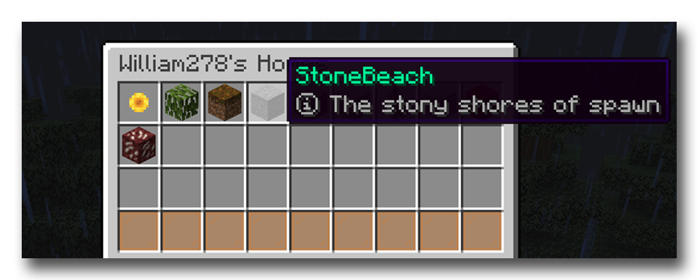

# GUI 附属

HuskHomesGUI 是一个 HuskHomes 的附属，允许你通过 GUI 界面（箱子风格的界面）而不是使用聊天栏菜单编辑家传送点。

你可以从 [Spigot](https://www.spigotmc.org/resources/huskhomesgui.91059/)、[PolyMart](https://polymart.org/resource/huskhomesgui.928) 和 [Modrinth](https://modrinth.com/plugin/huskhomesgui) 下载它，也可以[在这里浏览该插件的源码](https://github.com/WiIIiam278/HuskHomesGUI)。

## 安装教程

1. 下载最新版本的 HuskHomesGUI；
2. 将它放在你的服务器中的 `~/plugins/` 文件夹下，与最新版的 HuskHomes 一并安装；
3. 重启你的服务器；
4. 命令 `/home` 和 `/warp` 将会被 GUI 界面代替；
5. 如果你想，你可以编辑 `~/plugins/HuskHomesGUI/config.yml` 的文件来修改可视化的设置，或修改插件的显示语言。

## 命令列表

`/huskhomesgui <reload（重载插件）|about（显示插件信息）>` 命令允许你检查最新插件的版本，或是重载本插件。使用该命令的权限节点为 `huskhomesgui.command.huskhomesgui`