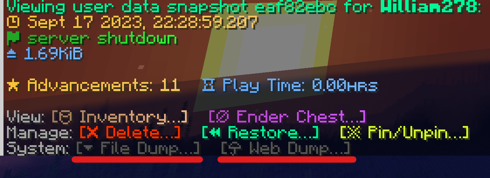

# 用户数据缓存
在 2.1 版本开始，HuskSync 可以将用户数据的快照缓存至 `json` 文件，或是选择保存至网络剪贴板（`mc.lo.gs`）。这个操作可以通过命令 `/userdata dump` 命令完成。

手动检测数据对数据同步问题排查非常有用。

## 使用说明

1. 使用之前确保你拥有权限 `husksync.command.userdata.dump`。玩家默认不会拥有该权限，管理员也是如此；
2. 使用命令 `/userdata list <玩家名称>` 来浏览玩家的数据内容；
3. 点击指定用户的数据条目。快照浏览菜单会出现，底部会出现两个新的按钮。



### 输出为文件
点击“输出文件...”按钮后（与命令 `/userdata dump <玩家名称> <快照 ID> file` 等价），该用户的数据缓存将会在目录 `~/plugins/HuskSync/dumps` 输出。
输出的 .json 文件名称通常按照下列格式：`<玩家名>_<时间戳>_<保存原因>_<短UUID>.json`

示例的输出文件：William278_2022-10-12_21-46-37_disconnect_f7719f5c.json
```json
{
  "status": {
    "health": 20.0,
    "max_health": 20.0,
    "health_scale": 0.0,
    "hunger": 20,
    "saturation": 0.0,
    "saturation_exhaustion": 0.24399996,
    "selected_item_slot": 1,
    "total_experience": 0,
    "experience_level": 0,
    "experience_progress": 0.0,
    "game_mode": "CREATIVE",
    "is_flying": true
  },
  "inventory": {
    "serialized_items": "rO0ABXcEAAAAKXBwcHBwcHBwcHBwcHBwcHBwcHBwcHBwcHBwcHBwcHBzcgAXamF2YS51dGlsLkxp\r\nbmtlZEhhc2hNYXA0wE5cEGzA+wIAAVoAC2FjY2Vzc09yZGVyeHIAEWphdmEudXRpbC5IYXNoTWFw\r\nBQfawcMWYNEDAAJGAApsb2FkRmFjdG9ySQAJdGhyZXNob2xkeHA/QAAAAAAADHcIAAAAEAAAAAJ0\r\nAAF2c3IAEWphdmEubGFuZy5JbnRlZ2VyEuKgpPeBhzgCAAFJAAV2YWx1ZXhyABBqYXZhLmxhbmcu\r\nTnVtYmVyhqyVHQuU4IsCAAB4cAAADDB0AAR0eXBldAASTEVBVEhFUl9DSEVTVFBMQVRFeABwc3EA\r\nfgAAP0AAAAAAAAx3CAAAABAAAAADcQB+AANzcQB+AAQAAAwwcQB+AAd0AAdCRURST0NLdAAGYW1v\r\ndW50c3EAfgAEAAAAQHgAcHBwcHBwcA\u003d\u003d\r\n"
  },
  "ender_chest": {
    "serialized_items": "rO0ABXcEAAAAG3NyABdqYXZhLnV0aWwuTGlua2VkSGFzaE1hcDTATlwQbMD7AgABWgALYWNjZXNz\r\nT3JkZXJ4cgARamF2YS51dGlsLkhhc2hNYXAFB9rBwxZg0QMAAkYACmxvYWRGYWN0b3JJAAl0aHJl\r\nc2hvbGR4cD9AAAAAAAAMdwgAAAAQAAAAA3QAAXZzcgARamF2YS5sYW5nLkludGVnZXIS4qCk94GH\r\nOAIAAUkABXZhbHVleHIAEGphdmEubGFuZy5OdW1iZXKGrJUdC5TgiwIAAHhwAAAMMHQABHR5cGV0\r\nAA1TUFJVQ0VfUExBTktTdAAGYW1vdW50c3EAfgAEAAAAQHgAc3EAfgAAP0AAAAAAAAx3CAAAABAA\r\nAAADcQB+AANzcQB+AAQAAAwwcQB+AAd0AAdCRURST0NLcQB+AAlxAH4ACngAc3EAfgAAP0AAAAAA\r\nAAx3CAAAABAAAAADcQB+AANzcQB+AAQAAAwwcQB+AAdxAH4ADXEAfgAJcQB+AAp4AHNxAH4AAD9A\r\nAAAAAAAMdwgAAAAQAAAAA3EAfgADc3EAfgAEAAAMMHEAfgAHcQB+AA1xAH4ACXEAfgAKeABzcQB+\r\nAAA/QAAAAAAADHcIAAAAEAAAAANxAH4AA3NxAH4ABAAADDBxAH4AB3EAfgANcQB+AAlxAH4ACngA\r\nc3EAfgAAP0AAAAAAAAx3CAAAABAAAAADcQB+AANzcQB+AAQAAAwwcQB+AAdxAH4ADXEAfgAJcQB+\r\nAAp4AHNxAH4AAD9AAAAAAAAMdwgAAAAQAAAAA3EAfgADc3EAfgAEAAAMMHEAfgAHcQB+AA1xAH4A\r\nCXEAfgAKeABzcQB+AAA/QAAAAAAADHcIAAAAEAAAAANxAH4AA3NxAH4ABAAADDBxAH4AB3EAfgAN\r\ncQB+AAlxAH4ACngAc3EAfgAAP0AAAAAAAAx3CAAAABAAAAADcQB+AANzcQB+AAQAAAwwcQB+AAdx\r\nAH4ADXEAfgAJcQB+AAp4AHNxAH4AAD9AAAAAAAAMdwgAAAAQAAAAA3EAfgADc3EAfgAEAAAMMHEA\r\nfgAHcQB+AA1xAH4ACXEAfgAKeABzcQB+AAA/QAAAAAAADHcIAAAAEAAAAANxAH4AA3NxAH4ABAAA\r\nDDBxAH4AB3EAfgANcQB+AAlxAH4ACngAc3EAfgAAP0AAAAAAAAx3CAAAABAAAAADcQB+AANzcQB+\r\nAAQAAAwwcQB+AAdxAH4ADXEAfgAJcQB+AAp4AHNxAH4AAD9AAAAAAAAMdwgAAAAQAAAAA3EAfgAD\r\nc3EAfgAEAAAMMHEAfgAHcQB+AA1xAH4ACXEAfgAKeABzcQB+AAA/QAAAAAAADHcIAAAAEAAAAANx\r\nAH4AA3NxAH4ABAAADDBxAH4AB3EAfgANcQB+AAlxAH4ACngAc3EAfgAAP0AAAAAAAAx3CAAAABAA\r\nAAADcQB+AANzcQB+AAQAAAwwcQB+AAdxAH4ADXEAfgAJcQB+AAp4AHNxAH4AAD9AAAAAAAAMdwgA\r\nAAAQAAAAA3EAfgADc3EAfgAEAAAMMHEAfgAHcQB+AA1xAH4ACXEAfgAKeABzcQB+AAA/QAAAAAAA\r\nDHcIAAAAEAAAAANxAH4AA3NxAH4ABAAADDBxAH4AB3EAfgANcQB+AAlxAH4ACngAc3EAfgAAP0AA\r\nAAAAAAx3CAAAABAAAAADcQB+AANzcQB+AAQAAAwwcQB+AAdxAH4ADXEAfgAJcQB+AAp4AHNxAH4A\r\nAD9AAAAAAAAMdwgAAAAQAAAAA3EAfgADc3EAfgAEAAAMMHEAfgAHcQB+AA1xAH4ACXEAfgAKeABz\r\ncQB+AAA/QAAAAAAADHcIAAAAEAAAAANxAH4AA3NxAH4ABAAADDBxAH4AB3EAfgANcQB+AAlxAH4A\r\nCngAc3EAfgAAP0AAAAAAAAx3CAAAABAAAAADcQB+AANzcQB+AAQAAAwwcQB+AAdxAH4ADXEAfgAJ\r\ncQB+AAp4AHNxAH4AAD9AAAAAAAAMdwgAAAAQAAAAA3EAfgADc3EAfgAEAAAMMHEAfgAHcQB+AA1x\r\nAH4ACXEAfgAKeABzcQB+AAA/QAAAAAAADHcIAAAAEAAAAANxAH4AA3NxAH4ABAAADDBxAH4AB3EA\r\nfgANcQB+AAlxAH4ACngAc3EAfgAAP0AAAAAAAAx3CAAAABAAAAADcQB+AANzcQB+AAQAAAwwcQB+\r\nAAdxAH4ACHEAfgAJcQB+AAp4AHNxAH4AAD9AAAAAAAAMdwgAAAAQAAAAA3EAfgADc3EAfgAEAAAM\r\nMHEAfgAHcQB+AAhxAH4ACXEAfgAKeABzcQB+AAA/QAAAAAAADHcIAAAAEAAAAANxAH4AA3NxAH4A\r\nBAAADDBxAH4AB3EAfgAIcQB+AAlxAH4ACngAc3EAfgAAP0AAAAAAAAx3CAAAABAAAAADcQB+AANz\r\ncQB+AAQAAAwwcQB+AAdxAH4ACHEAfgAJcQB+AAp4AA\u003d\u003d\r\n"
  },
  "potion_effects": {
    "serialized_potion_effects": ""
  },
  "advancements": [
    {
      "key": "minecraft:recipes/transportation/mangrove_boat",
      "completed_criteria": {
        "in_water": "Oct 11, 2022, 10:07:07 PM"
      }
    },
    {
      "key": "minecraft:recipes/redstone/spruce_button",
      "completed_criteria": {
        "has_planks": "Oct 11, 2022, 9:25:12 PM"
      }
    },
    {
      "key": "minecraft:recipes/misc/iron_nugget_from_smelting",
      "completed_criteria": {
        "has_chainmail_leggings": "Oct 12, 2022, 5:43:37 PM"
      }
    },
    {
      "key": "minecraft:recipes/redstone/spruce_pressure_plate",
      "completed_criteria": {
        "has_planks": "Oct 11, 2022, 9:25:12 PM"
      }
    },
    {
      "key": "minecraft:recipes/redstone/warped_pressure_plate",
      "completed_criteria": {
        "has_planks": "Oct 12, 2022, 5:43:22 PM"
      }
    },
    {
      "key": "minecraft:recipes/decorations/spruce_sign",
      "completed_criteria": {
        "has_planks": "Oct 11, 2022, 9:25:12 PM"
      }
    },
    {
      "key": "minecraft:recipes/redstone/spruce_trapdoor",
      "completed_criteria": {
        "has_planks": "Oct 11, 2022, 9:25:12 PM"
      }
    },
    {
      "key": "minecraft:recipes/building_blocks/warped_slab",
      "completed_criteria": {
        "has_planks": "Oct 12, 2022, 5:43:22 PM"
      }
    },
    {
      "key": "minecraft:recipes/redstone/spruce_door",
      "completed_criteria": {
        "has_planks": "Oct 11, 2022, 9:25:12 PM"
      }
    },
    {
      "key": "minecraft:recipes/redstone/spruce_fence_gate",
      "completed_criteria": {
        "has_planks": "Oct 11, 2022, 9:25:12 PM"
      }
    },
    {
      "key": "minecraft:recipes/decorations/crafting_table",
      "completed_criteria": {
        "has_planks": "Oct 11, 2022, 9:25:12 PM"
      }
    },
    {
      "key": "minecraft:recipes/decorations/chest",
      "completed_criteria": {
        "has_lots_of_items": "Oct 12, 2022, 5:43:42 PM"
      }
    },
    {
      "key": "minecraft:story/shiny_gear",
      "completed_criteria": {
        "diamond_boots": "Oct 12, 2022, 5:43:36 PM"
      }
    },
    {
      "key": "minecraft:recipes/misc/stick",
      "completed_criteria": {
        "has_planks": "Oct 11, 2022, 9:25:12 PM"
      }
    },
    {
      "key": "minecraft:recipes/redstone/warped_fence_gate",
      "completed_criteria": {
        "has_planks": "Oct 12, 2022, 5:43:22 PM"
      }
    },
    {
      "key": "minecraft:recipes/transportation/acacia_boat",
      "completed_criteria": {
        "in_water": "Oct 11, 2022, 10:07:07 PM"
      }
    },
    {
      "key": "minecraft:recipes/misc/iron_nugget_from_blasting",
      "completed_criteria": {
        "has_chainmail_leggings": "Oct 12, 2022, 5:43:37 PM"
      }
    },
    {
      "key": "minecraft:recipes/decorations/warped_fence",
      "completed_criteria": {
        "has_planks": "Oct 12, 2022, 5:43:22 PM"
      }
    },
    {
      "key": "minecraft:adventure/adventuring_time",
      "completed_criteria": {
        "minecraft:beach": "Oct 12, 2022, 5:10:27 PM",
        "minecraft:old_growth_pine_taiga": "Oct 12, 2022, 9:32:20 PM",
        "minecraft:dark_forest": "Oct 11, 2022, 9:24:06 PM",
        "minecraft:forest": "Oct 11, 2022, 10:06:58 PM",
        "minecraft:taiga": "Oct 12, 2022, 8:58:59 PM",
        "minecraft:river": "Oct 11, 2022, 10:07:07 PM",
        "minecraft:stony_shore": "Oct 11, 2022, 9:23:59 PM",
        "minecraft:snowy_plains": "Oct 11, 2022, 10:08:53 PM",
        "minecraft:snowy_taiga": "Oct 12, 2022, 3:38:05 PM",
        "minecraft:frozen_river": "Oct 11, 2022, 10:09:54 PM",
        "minecraft:windswept_gravelly_hills": "Oct 12, 2022, 3:14:39 PM",
        "minecraft:old_growth_spruce_taiga": "Oct 12, 2022, 9:42:12 PM",
        "minecraft:snowy_beach": "Oct 11, 2022, 10:08:40 PM",
        "minecraft:plains": "Oct 11, 2022, 10:07:07 PM"
      }
    },
    {
      "key": "minecraft:recipes/decorations/barrel",
      "completed_criteria": {
        "has_planks": "Oct 11, 2022, 9:25:12 PM"
      }
    },
    {
      "key": "minecraft:recipes/transportation/spruce_boat",
      "completed_criteria": {
        "in_water": "Oct 11, 2022, 10:07:07 PM"
      }
    },
    {
      "key": "minecraft:recipes/redstone/redstone_from_smelting_redstone_ore",
      "completed_criteria": {
        "has_redstone_ore": "Oct 11, 2022, 10:21:34 PM"
      }
    },
    {
      "key": "minecraft:recipes/transportation/birch_boat",
      "completed_criteria": {
        "in_water": "Oct 11, 2022, 10:07:07 PM"
      }
    },
    {
      "key": "minecraft:recipes/decorations/spruce_fence",
      "completed_criteria": {
        "has_planks": "Oct 11, 2022, 9:25:12 PM"
      }
    },
    {
      "key": "minecraft:recipes/building_blocks/spruce_stairs",
      "completed_criteria": {
        "has_planks": "Oct 11, 2022, 9:25:12 PM"
      }
    },
    {
      "key": "minecraft:recipes/transportation/oak_boat",
      "completed_criteria": {
        "in_water": "Oct 11, 2022, 10:07:07 PM"
      }
    },
    {
      "key": "minecraft:recipes/redstone/redstone_from_blasting_redstone_ore",
      "completed_criteria": {
        "has_redstone_ore": "Oct 11, 2022, 10:21:34 PM"
      }
    },
    {
      "key": "minecraft:recipes/redstone/warped_button",
      "completed_criteria": {
        "has_planks": "Oct 12, 2022, 5:43:22 PM"
      }
    },
    {
      "key": "minecraft:recipes/building_blocks/warped_stairs",
      "completed_criteria": {
        "has_planks": "Oct 12, 2022, 5:43:22 PM"
      }
    },
    {
      "key": "minecraft:recipes/redstone/warped_trapdoor",
      "completed_criteria": {
        "has_planks": "Oct 12, 2022, 5:43:22 PM"
      }
    },
    {
      "key": "minecraft:recipes/building_blocks/spruce_slab",
      "completed_criteria": {
        "has_planks": "Oct 11, 2022, 9:25:12 PM"
      }
    },
    {
      "key": "minecraft:recipes/decorations/warped_sign",
      "completed_criteria": {
        "has_planks": "Oct 12, 2022, 5:43:22 PM"
      }
    },
    {
      "key": "minecraft:recipes/transportation/jungle_boat",
      "completed_criteria": {
        "in_water": "Oct 11, 2022, 10:07:07 PM"
      }
    },
    {
      "key": "minecraft:recipes/transportation/dark_oak_boat",
      "completed_criteria": {
        "in_water": "Oct 11, 2022, 10:07:07 PM"
      }
    },
    {
      "key": "minecraft:recipes/redstone/warped_door",
      "completed_criteria": {
        "has_planks": "Oct 12, 2022, 5:43:22 PM"
      }
    }
  ],
  "statistics": {
    "untyped_statistics": {
      "LEAVE_GAME": 16,
      "TOTAL_WORLD_TIME": 282633,
      "CROUCH_ONE_CM": 43,
      "WALK_UNDER_WATER_ONE_CM": 113,
      "DEATHS": 4,
      "WALK_ONE_CM": 7313,
      "JUMP": 866,
      "SPRINT_ONE_CM": 63807,
      "DROP_COUNT": 9,
      "WALK_ON_WATER_ONE_CM": 331,
      "TIME_SINCE_DEATH": 282357,
      "SNEAK_TIME": 95,
      "FLY_ONE_CM": 584296,
      "ENDERCHEST_OPENED": 2,
      "PLAY_ONE_MINUTE": 282633,
      "TIME_SINCE_REST": 282377
    },
    "block_statistics": {},
    "item_statistics": {
      "PICKUP": {
        "SUGAR_CANE": 2
      },
      "DROP": {
        "SPRUCE_PLANKS": 70,
        "TURTLE_HELMET": 1,
        "DIAMOND_BOOTS": 1,
        "BEDROCK": 1,
        "CHAINMAIL_LEGGINGS": 1,
        "MANGROVE_PROPAGULE": 1,
        "LEATHER_CHESTPLATE": 1
      },
      "USE_ITEM": {
        "TURTLE_HELMET": 1,
        "DIAMOND_BOOTS": 1,
        "GRASS_BLOCK": 5,
        "ENDER_CHEST": 1,
        "CHAINMAIL_LEGGINGS": 1,
        "LEATHER_CHESTPLATE": 1
      }
    },
    "entity_statistics": {}
  },
  "persistent_data_container": {
    "persistent_data_map": {}
  },
  "minecraft_version": "1.19.2",
  "format_version": 3
}
```

### 上传至网络

按钮“上传至网络...”（与命令 `/userdata dump <玩家名称> <快照 ID> web` 等价）将会输出玩家的数据快照至 https://mc.lo.gs 托管平台，并将输出的文本以链接的形式发给你。需要注意的是，若用户数据超过了 10MB，则剪贴板服务可能会超时。