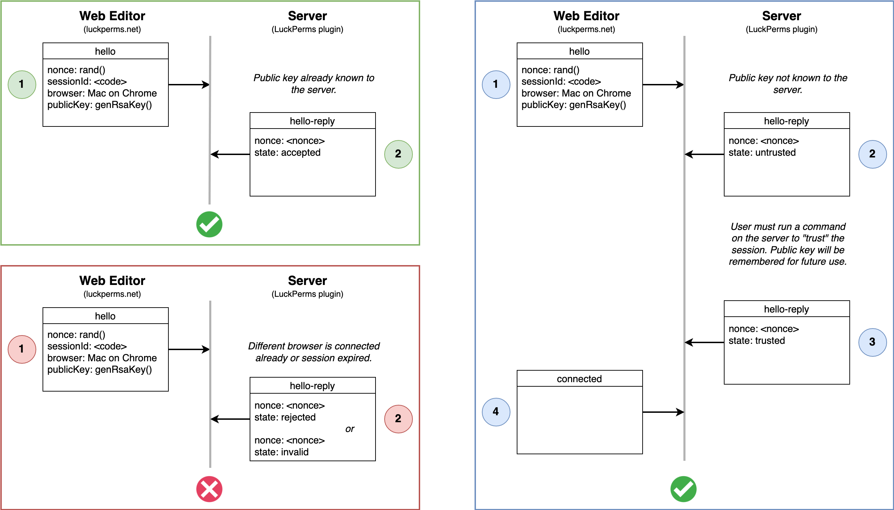
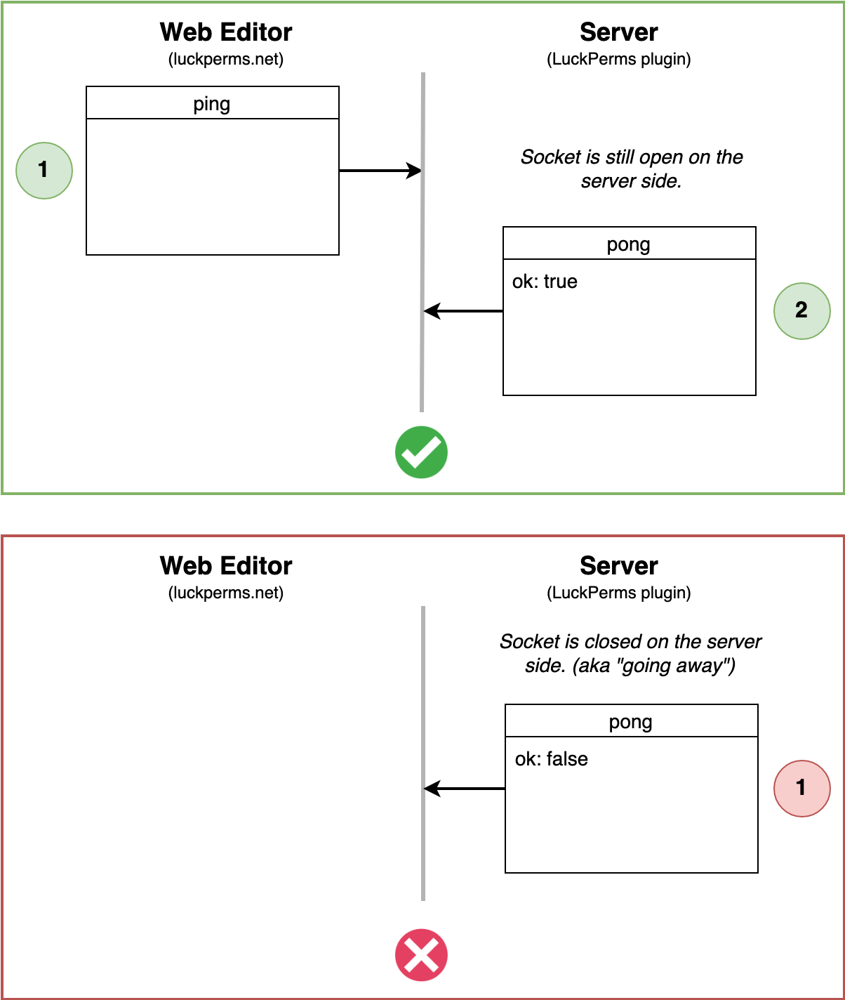
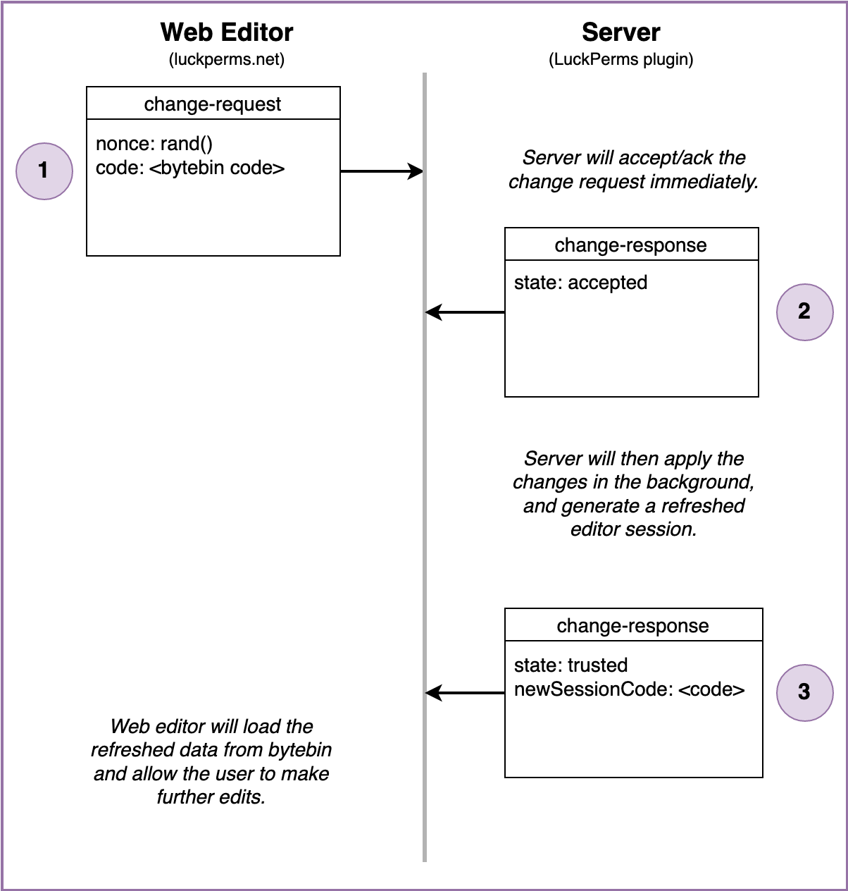

# 网页编辑器的技术细节

LuckPerms 的网页编辑器是运行在浏览器中的特殊应用，允许服务器管理员通过网页界面编辑权限。

面向用户的文档可以访问[网页编辑器](features.web-editor.md)。本章节讲述的大部分为技术性信息。

## 与服务器连接

网页编辑器是由中心托管的（在 luckperms.net 上），但也需要能够与用户服务器上的 LuckPerms 插件进行通信。

网页编辑器本身无状态，但它会使用两个特殊服务与服务器交换信息。

* [bytebin](https://github.com/lucko/bytebin) - 通过 HTTP 的 GET/POST 方法交换负载数据
* [bytesocks](https://github.com/lucko/bytesocks) - 通过 WebSockets 交换“实时”信息

插件（在 Minecraft 服务器上运行的）和网页编辑器（在浏览器中运行的）都需要与“中间人”服务器交流，并使用它们与对方交换数据/指令。

## WebSocket 协议

服务器和网页编辑器都会连接至由 bytesocks 服务（见上）提供的 WebSocket。它们会在这个频道内交换安全（秘密签署的）信息。

更多安全有关的信息可以在添加该功能的[合并请求](https://github.com/LuckPerms/LuckPerms/pull/3303)上查看。

### 通信（包）格式

通信包以 JSON 格式编写。

``` JSON
{
    "msg": "string",
    "signature": "string",
}
```

外部通信“frame”会显示上述两部分的内容。

* `msg` 部分包含了 JSON 格式纯文本编码的包（未经加密）
* `signature` 部分包含了来自通信的 SHA256withRSA 签名信息，且为 base64 加密。

### 连接

在内部会话创建（通过玩家在当前服务器输入命令 `/lp editor`）时，插件将会为此次会话产生一个新的 bytesocks 频道并立即加入。bytesocks 频道的 ID 与插件公钥包含在初始 bytebin 的数据负载中。玩家在打开网页编辑器链接时，bytebin 负载会以末尾的一段参数表示。

网页编辑器只接受频道中经过插件/服务器公钥签名的信息。

连接流程会在网页编辑器发送 `hello` 消息至频道（服务器应当已连接且“监听”频道）

`hello` 信息包含：

* nonce - 简短的随机字符串，用于验证会话
* sessionId - 网页编辑器打开的 bytebin ID
* browser - 使用的操作系统/浏览器简单描述
* publicKey - 编辑器公钥。用于确保从编辑器接收的后续信息未被篡改。

在连接流程中，Minecraft 服务器（LuckPerms 插件）会确保：

* 前一次会话中编辑器公钥可知
* 玩家已经通过命令信任编辑器。该过程使用 nonce 来确保他们在 >1 次的连接中信任的设备相对应。

服务器会返回一个 `hello-reply` 消息来告知编辑器下一步操作。



在连接建立后，服务器只会接收以编辑器密钥签名的信息。

### Ping

网页编辑器会间断发送 `ping` 消息，如果服务器还在监听，则会发回一个 `pong` 消息。

这个行为有两个目的：

* 保持 WebSocket 频道活跃。一些中间 Web 代理会强制要求 keepalive，若消息一段时间内没有发送，则 socket 连接会被视作超时。
* 使得网页编辑器能够知晓服务器是否仍在监听，这样就可以使用 socket 来发送更新。



服务器也会使用 `pong` 消息来告知它已从 socket 断开连接。这样做的原因如下：

* Minecraft 服务器已关闭
* 创建会话的用户已离开服务器
* 连接超时
* 未知错误

### 请求修改

在用户按下编辑器“应用（保存）”，这部分流程就会被触发。

网页编辑器会将变动上传至 bytebin 并收集负载 ID。它之后就会通过 socket 将 ID 传回服务器。

服务器会应用改动，然后上传 bytebin 中的刷新状态，并通过 socket 将负载 ID 传回。

