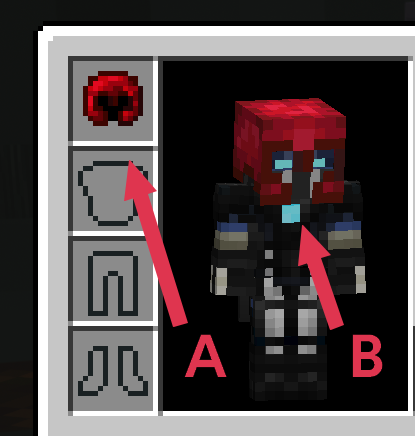
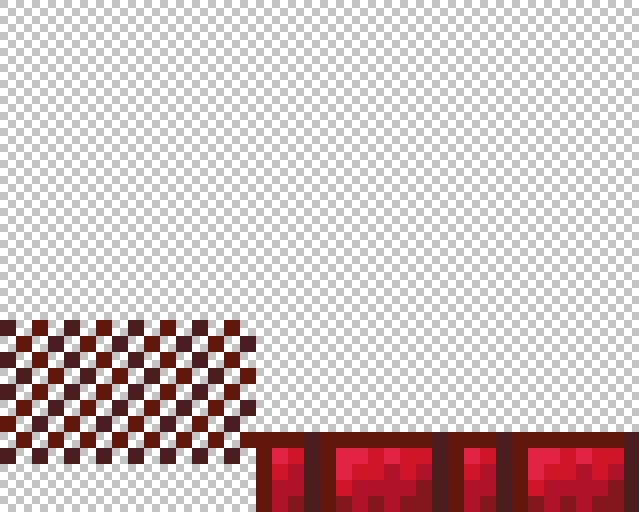
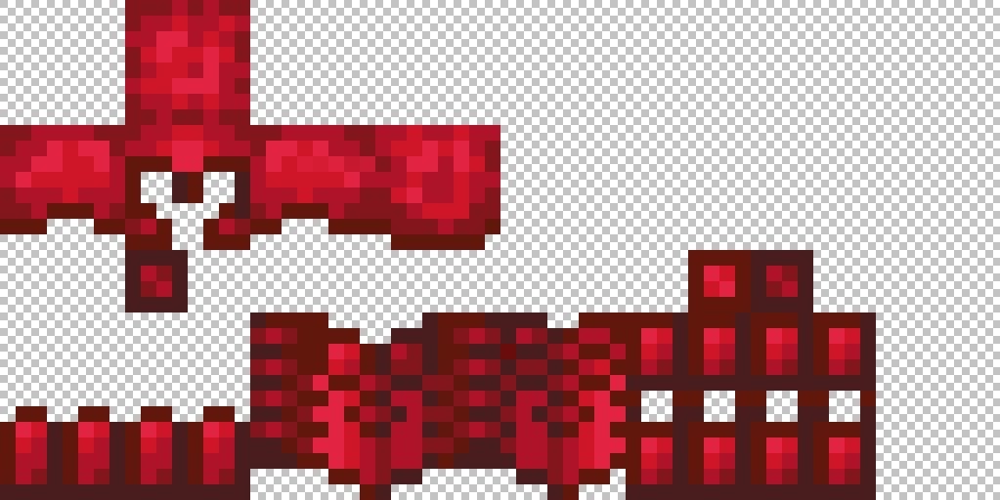

# 自定义盔甲
如何在不替换已有物品的情况下创建自定义盔甲？

与其他物品相同，盔甲在背包中和装备时使用两张贴图。

Oraxen 能够通过两种方式添加自定义盔甲：纹饰或着色器。

纹饰通过 1.20 添加的盔甲纹饰系统实现，且不在低于 1.20 的版本上生效。

着色器则使用了 1.17 加入的 core-shaders。

**盔甲纹饰** 推荐核心为 1.20+ 且仅允许 1.20+ 的玩家进入的服务器使用。

它的优点是不会破坏原有着色器，且无需额外模组。

它也可以使盔甲真实物品不仅限于皮革盔甲，但默认情况下为锁链盔甲。

**核心着色器** 推荐 1.20 以下且允许低版本玩家进入的服务器使用。

与盔甲纹饰相比，这个方法会破坏 Optifine 与 Iris 使用的着色器。

若要修复这个问题，Oraxen 会将 CIT 纹理置入资源包。

这个方法能完美解决与 Optifine 的兼容性问题，但使用 Iris 的玩家需要用到 [CIT Resewn](https://modrinth.com/mod/cit-resewn)。

## 自定义盔甲 - 盔甲纹饰

若你选择了纹饰作为 `custom-armor` 的类型，插件会帮你处理好大部分内容。

与核心着色器方法不同的是，盔甲纹饰可以不仅限于皮革材质。


默认情况下，Oraxen 使用锁链（`CHAINMAIL`），但可以在 `settings.yml` 中修改这些内容。

这之后，Oraxen 会基于你的自定义盔甲配置生成数据包。

因为它需要用到数据包，你需要在添加/移除盔甲套装后完全重启服务器才可应用改动。

> [!WARNING|label:警告]
> 将 `CustomArmor.armor_type` 设置为 `TRIMS` 后，你需要：
> 1. 启动服务器，让其生成数据包
> 2. 关闭服务器
> 3. 再次重启，使其应用先前生成的数据包

### 如何配置盔甲？

> [!INFO|label:提示]
> 确保你的 Oraxen 物品的 itemID 遵照了`盔甲名称_盔甲类型`的格式。
> 
> 对于上文的示例，则为 `ruby_chestplate`、`ruby_leggings` 和 `ruby_boots`。
>
> 
> 确保你的 `armor-layer` 文件遵照了 `**盔甲名称**_armor_layer_1或2.png` 的格式。
> 
> 在下文的示例中，我们需要一份 `**ruby**_armor_layer_1.png` 和 `**ruby**_armor_layer_2.png` 文件。

只需设置材料并指定两次纹理图标即可：

```YAML
ruby_helmet:
  displayname: "<gradient:#FA7CBB:#F14658>红宝石头盔"
  material: CHAINMAIL_HELMET
  Pack:
    generate_model: true
    parent_model: "item/generated"
    textures:
      - default/armors/ruby_helmet
      - default/armors/ruby_helmet
```

`trim_pattern` 必须存在才能让盔甲正常显示。

Oraxen 会在未指定该内容的情况下自动分配。

你也可以在 `trim_pattern` 下手动设置。

值应当为 `oraxen:盔甲名称`，所以在我们的示例中，它应该像这样：

```YAML
ruby_helmet:
  trim_pattern: oraxen:ruby
```

## 自定义盔甲 - 核心着色器

这是 Oraxen 实现自定义盔甲的第二种方法，会用到染色皮革和着色器。

与其他物品相同，盔甲在背包中和装备时使用两张贴图。

装备时使用的贴图有一些限制并需要进一步测试。这时我们会用到一种技巧。

> [!WARNING|label:警告]
> 如果你通过 Optifine 或 Iris 使用了自定义着色器，你需要做一些额外的处理才能让自定义物品正常显示。
>
> 对于 Optifine，所有事情都会由插件自动处理。
> 
> 对于 Iris，你需要安装 [CIT Resewn](https://modrinth.com/mod/cit-resewn)，这之后的所有内容都会为你处理好。



> [!WARNING|label:警告]
> 命名装备时需要小心，防止纹理无法识别。
> 
> 如果你想要创建一个**紫水晶（amethyst）**套装，则你的套装物品必须是这样：
> 
> - **amethyst**_helmet
> - **amethyst**_chestplate
> - **amethyst**_leggings
> - **amethyst**_boots
> 在[第二步](#2-正确命名纹理)中创建的对应纹理名称应当是这样的：
> - **amethyst**_armor_layer_1.png
> - **amethyst**_armor_layer_2.png

#### 如何配置你的盔甲？

在这个示例中，我们会使用下面的配置作为参考：

```YAML
ruby_helmet:
  displayname: "<gradient:#FA7CBB:#F14658>红宝石头盔"
  material: LEATHER_HELMET
  Pack:
    generate_model: true
    parent_model: "item/generated"
    textures:
      - default/armors/ruby_helmet
      - default/armors/ruby_helmet
```

> [!INFO|label:提示]
> 确保你的 Oraxen 物品的 itemID 遵照了`盔甲名称_盔甲类型`的格式。
> 
> 对于上文的示例，则为 `ruby_chestplate`、`ruby_leggings` 和 `ruby_boots`。

> [!INFO|label:提示]
> 这也是只有皮革盔甲才会生效的原因。
>
> 自定义盔甲不能以钻石为基础材料。
>
> 若要设置自定义盔甲数量，设置属性修饰符（Attribute Modifiers）即可。

### 如何修改装备外观？

现在事情才真正有趣起来。我们会使用原版着色器将盔甲类型与指定颜色关联。

Oraxen 现在使用的着色器是 [Ancientkingg](https://twitter.com/ancientkingg) 开发的。感谢！

#### 1) 创建你的纹理

你需要为你的盔甲创建两张纹理图片。你可以在这里下载红宝石盔甲的示例纹理：

https://oraxen.com/resources/armor_rest.png

https://oraxen.com/resources/armor_leggings.png

> [!WARNING|label:警告]
> 请确保你的纹理分辨率与 `settings.yml` 中的相符合。
> 默认情况下分辨率设置为 16。这意味着你的盔甲纹理大小必须为 64x32 像素。
> 若你想要使用更高的分辨率，你需要修改 `settings.yml` 中的值。例如，128*64分辨率的盔甲纹理必须在 `settings.yml` 将分辨率设置为 32。你不能让一部分纹理使用 64x32，而另一部分使用 128x64，这个设置只能一刀切。
>
> 另外你还需要确保纹理的位深度是 32 位。
> 其他深度会导致渐变不完全，且着色器使用的像素为黑色。
> 这不会破坏 Optifine 或 Iris 版本的纹理包，但有可能破坏原版的纹理包。





> [!TIP|label:提示]
> 你可以通过在文件夹中添加 **\_e\_.png** 结尾的文件，让你的纹理具有**辐射**（无需 Optifine）。例如 `ruby_armor_layer_1_e.png`。
> 这张纹理会被当做辐射图，像素点的 Alpha 通道值会视作辐射量。

#### 2) 正确命名纹理

若要让你的纹理正确注册，它们需要包含 `armor_layer_X`。

例如：`ruby_armor_layer_1.png` 和 `ruby_armor_layer_2.png`。你可以将它们放在纹理包文件夹中的任何位置，但推荐你放在 `~/textures/default/armors` 中。