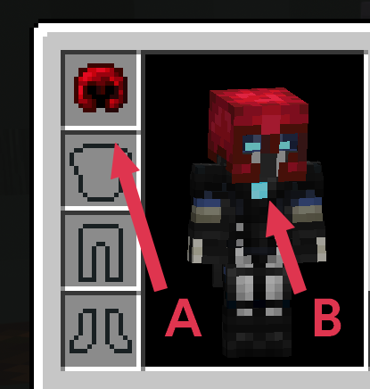
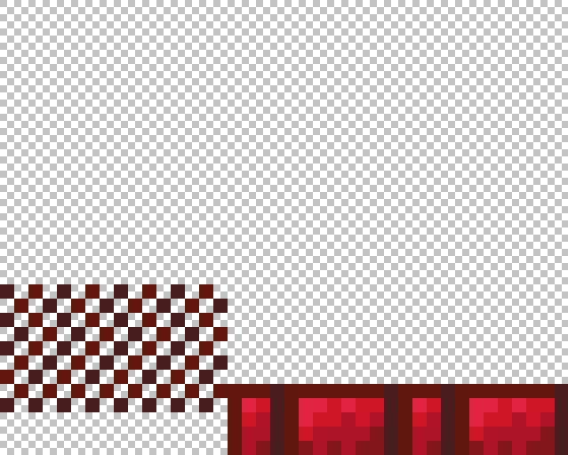

# 基于核心着色器（1.18-1.19.4）

这是 Oraxen 实现自定义盔甲的第二种方法，会用到染色皮革和着色器。

与其他物品相同，盔甲在背包中和装备时使用两张贴图。

装备时使用的贴图有一些限制并需要进一步测试。这时我们会用到一种技巧。

::: warning
如果你通过 Optifine 或 Iris 使用了自定义着色器，你需要做一些额外的处理才能让自定义物品正常显示。

对于 Optifine，所有事情都会由插件自动处理。

对于 Iris，你需要安装 [CIT Resewn](https://modrinth.com/mod/cit-resewn)，这之后的所有内容都会为你处理好。
:::



::: warning
命名装备时需要小心，否则纹理可能会无法识别。

如果你想要创建一个**紫水晶（amethyst）**套装，则你的套装物品必须是这样：

- **amethyst**_helmet
- **amethyst**_chestplate
- **amethyst**_leggings
- **amethyst**_boots
在[第二步](#2-正确命名纹理)中创建的对应纹理名称应当是这样的：
- **amethyst**_armor_layer_1.png
- **amethyst**_armor_layer_2.png

## 如何配置你的盔甲？

在这个示例中，我们会使用下面的配置作为参考：

``` YAML
ruby_helmet:
  displayname: "<gradient:#FA7CBB:#F14658>红宝石头盔"
  material: LEATHER_HELMET
  Pack:
    generate_model: true
    parent_model: "item/generated"
    textures:
      - default/armors/ruby_helmet
      - default/armors/ruby_helmet
```

::: info 提示
确保你的 Oraxen 物品的 itemID 遵照了`盔甲名称_盔甲类型`的格式。

对于上文的示例，则为 `ruby_chestplate`、`ruby_leggings` 和 `ruby_boots`。
:::

::: info 提示
这也是只有皮革盔甲才会生效的原因。

自定义盔甲不能以钻石为基础材料。

若要设置自定义盔甲数量，设置属性修饰符（Attribute Modifiers）即可。
:::

## 如何修改装备外观？

现在事情才真正有趣起来。我们会使用原版着色器将盔甲类型与指定颜色关联。

Oraxen 现在使用的着色器是 [Ancientkingg](https://twitter.com/ancientkingg) 开发的。感谢！

### 1) 创建你的纹理

你需要为你的盔甲创建两张纹理图片。你可以在这里下载红宝石盔甲的示例纹理：

https://oraxen.com/resources/armor_rest.png

https://oraxen.com/resources/armor_leggings.png

::: warning
请确保你的纹理分辨率与 `settings.yml` 中的相符合。
默认情况下分辨率设置为 16。这意味着你的盔甲纹理大小必须为 64x32 像素。
若你想要使用更高的分辨率，你需要修改 `settings.yml` 中的值。例如，128*64分辨率的盔甲纹理必须在 `settings.yml` 将分辨率设置为 32。你不能让一部分纹理使用 64x32，而另一部分使用 128x64，这个设置只能一刀切。

另外你还需要确保纹理的位深度是 32 位。
其他深度会导致渐变不完全，且着色器使用的像素为黑色。
这不会破坏 Optifine 或 Iris 版本的纹理包，但有可能破坏原版的纹理包。
:::




::: info 提示
你可以通过在文件夹中添加 **\_e\_.png** 结尾的文件，让你的纹理具有**辐射**（无需 Optifine）。例如 `ruby_armor_layer_1_e.png`。
这张纹理会被当做辐射图，像素点的 Alpha 通道值会视作辐射量。
:::

### 2) 正确命名纹理

若要让你的纹理正确注册，它们需要包含 `armor_layer_X`。

例如：`ruby_armor_layer_1.png` 和 `ruby_armor_layer_2.png`。你可以将它们放在纹理包文件夹中的任何位置，但推荐你放在 `~/textures/default/armors` 中。