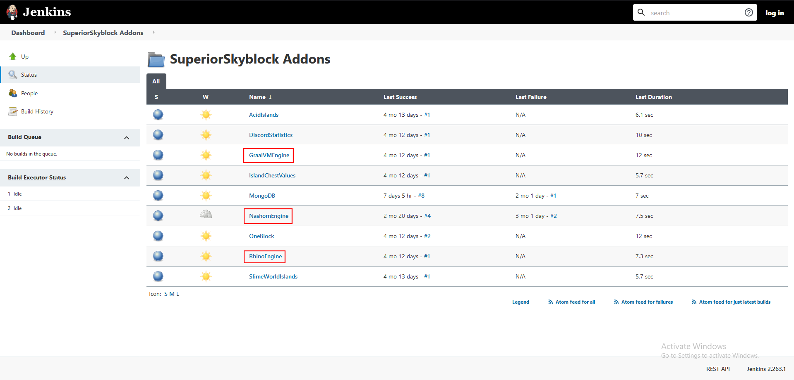

# JavaScript 引擎

::: info

在 1.8.1.360 版本后由插件自动实现

:::

若你想要使用 Java 15+ 又想使用 SuperiorSkyBlock，你必须下载一个外部的脚本引擎。插件的许多方面要用到脚本引擎，包括等级计算与任务相关内容。

## 如何安装外部脚本引擎？

目前市面上有多款脚本引擎，本章节着重讲述最易于使用且普遍的 Nashron 引擎。你可以在[这里](https://github.com/BG-Software-LLC/SuperiorSkyblock2-NashornEngine/)前往其 Github 仓库。你也可以在[拓展页面](overview.addons.md)找到有关其他脚本的更多信息。

::: info 注意

如果你选择使用 GraalVM 引擎，请确保你正确设置了它！

:::

## 第一步：下载 jar 文件

首先，下载你所需要的脚本引擎。你可以在 [Jenkins 页面](https://hub.bg-software.com/job/SuperiorSkyblock%20Addons/)上找到所有脚本引擎的构建。

## 第二步：将引擎放入模块文件夹

在下载文件之后，你需要将其放入模块文件夹。过程与安装普通插件大致相似！只需将 jar 文件放入 `SuperiorSkyBlock` 中即可。

## 最后一步：启动服务器

这就是最后一步——再次启动服务器！插件会载入模块并为你设置好所有内容！若你碰到了问题或是某些功能不正常工作的情况，你可以前往 [Discord 聊天群组](https://bg-software.com/discord/)联系我们。
