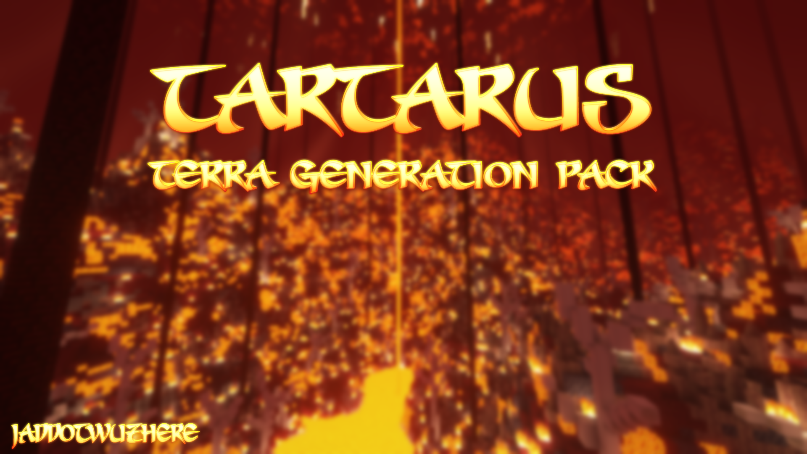
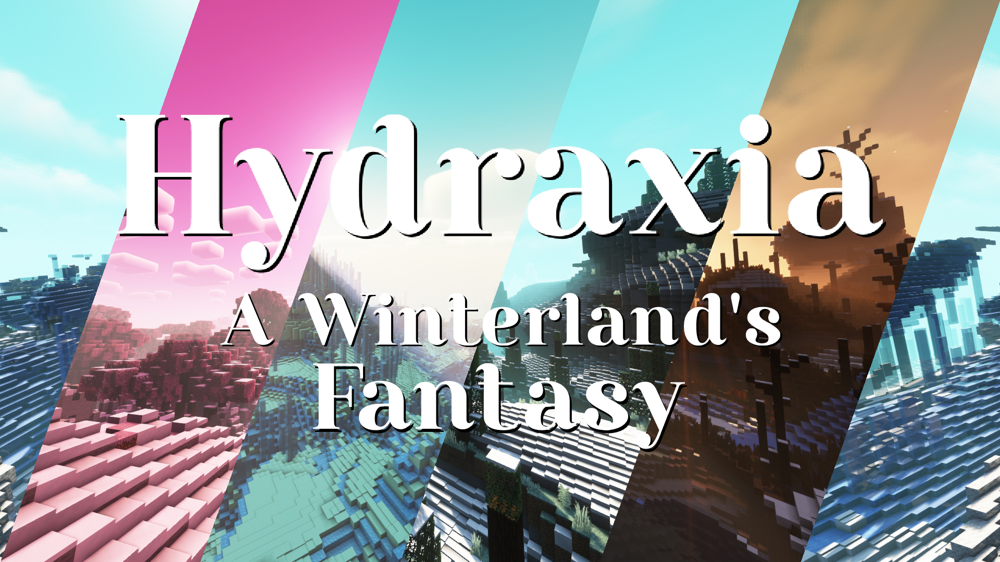
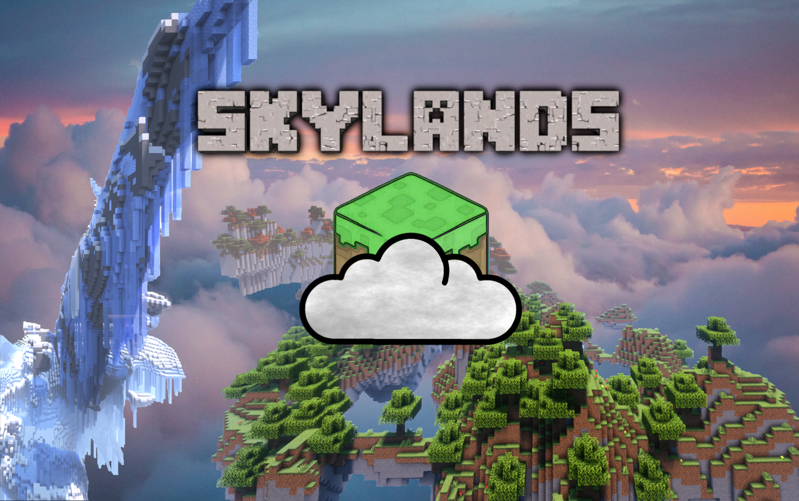
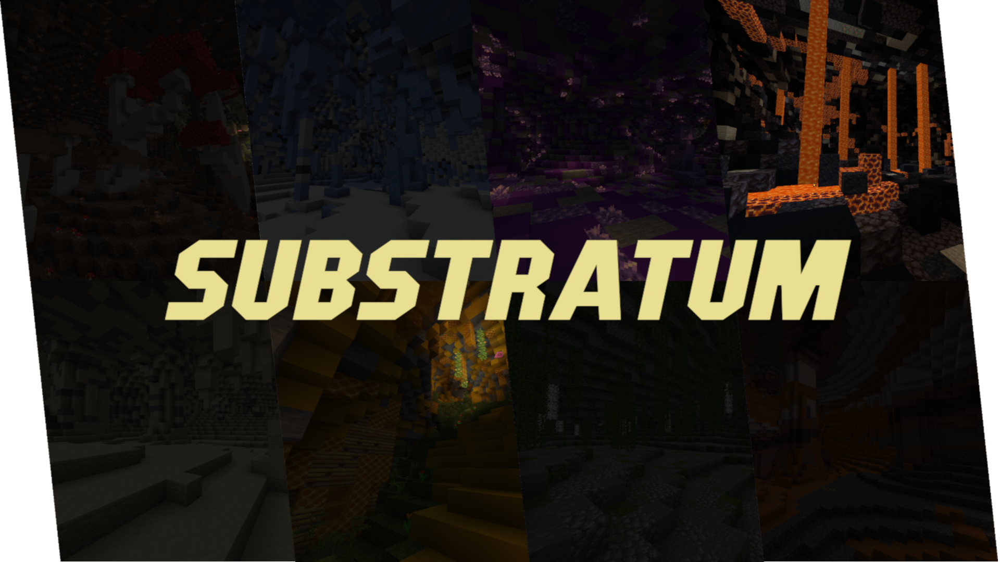
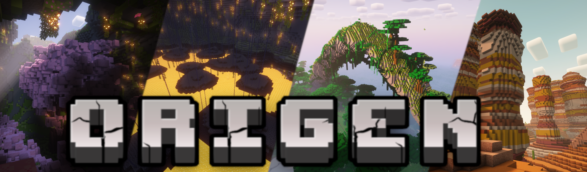

# 社区配置包

本页涵盖了一系列由 Terra 社区成员开发的地形包。
若要将你的作品添加至本页，请向[文档仓库](https://github.com/PolyhedralDev/TerraDocs)提交合并请求。

## Overworld Pack

**作者：** Astrash、Sancires、Aureus
**源码：** https://github.com/PolyhedralDev/TerraOverworldConfig
**支持版本：** 6.2+.x

这个地形包提供了许多的预设配置及变量！见“[修改已有地形包](config-packs.config-development.modifying-an-existing-pack.md)”章节了解更多。

## Tartarus

**作者：** Jaddot
**源码：** https://github.com/Jason-Ding19/Tartarus
**支持版本：** 6.x

为下界提供了许多新生物群系的拓展地形包！

## ReimagEND

**作者：** Aureus、RogueShade
**源码：** https://github.com/justaureus/ReimagEND
**支持版本：** 6.2+.x

为末地提供了许多的新生物群系、地物及地形的拓展包！

## Hydraxia

**作者：** Jaddot
**源码：** https://github.com/JaddotWuzHere/Hydraxia
**支持版本：** 6.2.x

将整个世界变为冬季奇幻大陆的地形包！

## SkyLands

**作者：** Falcon
**源码：** https://github.com/Gray-Falcon/SkyLands
**支持版本：** 6.2.x

将整个世界变为漂浮空岛，添加了全新的生物群系及结构！

## Aeropelago

**作者：** Astrash
**源码：** https://github.com/Astrashh/Aeropelago
**支持版本：** 6.2+.x

以浮空岛为主题的地形包。

## VoidWorld

**作者：** Aureus
**源码：** https://github.com/justaureus/VoidWorld
**支持版本：** 6.2+.x

面向 Terra 的简单虚空世界地形包。

## Substratum

**作者：** RogueShade
**源码：** https://github.com/DeathShadez/Substratum
**支持版本：** 6.2+.x

颠覆原版地形，将地下大幅改观，并增加了许多类型独特洞穴的地形包。

## Origen

**作者：** Rearth
**源码：** https://github.com/Rearth/Origen
**支持版本：** 6.4+.x

添加了更多全新的异域风格生物群系。基于默认的主世界地形包开发，大多数为添加的新生物群系。

