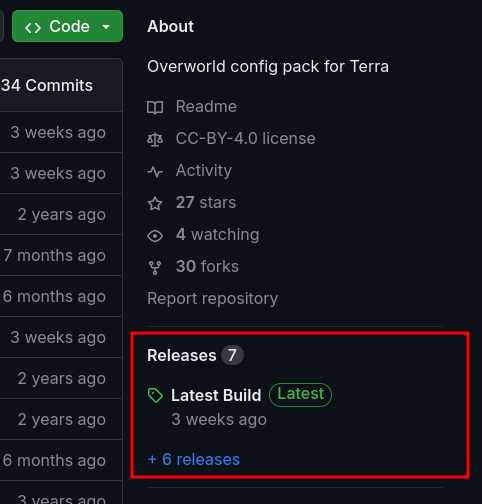
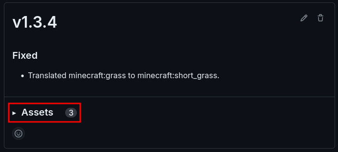
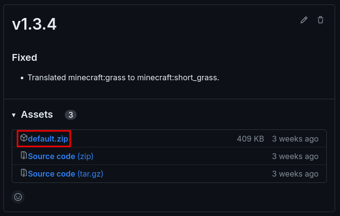
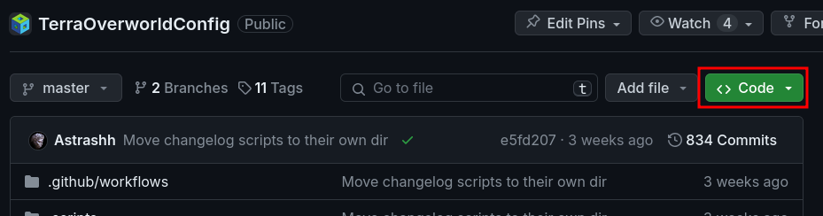
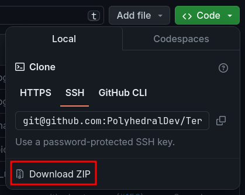
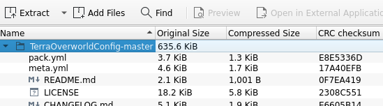

# 安装地形包

地形包的安装方式与资源包相似：

## 1. 下载你的地形包

:::::: info

你可以在[社区地形包](config-packs.community-packs.md)章节找到可用的地形包。

在进行下一步前，请确保：

* 检查地形包是否有其额外安装步骤，若有则照做。
* 检查需要安装的地形包是否与你当前版本的 Terra 兼容。

通常情况下地形包以 `.zip` 压缩文件的形式分发，不过它们也支持从文件夹加载。

::::: info 从 Github 下载

如果你正在从 Github 下载地形包，首先查看其 **自述（README）** 部分，就在文件列表的下方。这里可能包含重要信息，或配置地形包的方法。

如果自述文件没有额外讲述如何下载或安装，那么请前往 **发行版（Releases）** 部分。



:::: info 如果 Github 仓库有发行版部分

1. 打开它
2. 进入发行版页面后，选择你需要使用的版本
3. 若“内容（Assets）”为收起状态，则将其展开



4. 下载 `.zip` 结尾的地形包。**不要下载**标记为“源码（Source Code）”的压缩包，文件名称可能因作者上传方式而略有区别。



::::

:::: info 如果 Github 仓库没有发行版部分

1. 找到 **代码（Code）** 按钮并展开：



2. 点击**下载 ZIP 压缩包（Download ZIP）**：



完成之后你应该会得到一个 `.zip` 文件，其中包含一个文件夹。

3. 通过 7zip 或 WinRAR 等解压软件打开 `.zip` 文件。
4. 浏览压缩包内容，找到包含 `pack.yml` 的文件夹。通常情况下这是压缩包内的第一个文件夹，但仍有特殊情况。
  
例如，这个地形包在如下图片中是这样的：



那么这个文件夹就是你要安装的地形包。

::: info

如果你想要将这个压缩包上传至服务器，请确保其最上层目录包含了地形包文件，且不包含诸如 Github 包源码的其他内容。

:::

::::

:::::

::::::

## 2. 将地形包放入包目录

::: info

这会因版本不同而略有差异。

* Fabric - `/config/Terra/packs`
* Bukkit - `/plugins/Terra/packs`

:::

## 3. 确保目录结构正确

::: info 

通常情况，地形包按 `.zip` 分发时，可以直接放入包目录中加载。

如果情况不同，或者包载入失败，确保包的完整性，或者请保证 `pack.yml` 存在文件夹/压缩包内，且格式如下：

<badge type="tip" text="正确" /> - **`Terra/packs/待安装地形包/pack.yml`**

``` text
Terra/
├── packs/
┆   ├── default.zip
    └── 待安装地形包/
        ├── pack.yml
        ┆
```

<badge type="danger" text="错误" /> - **`Terra/packs/待安装地形包/<文件夹>/pack.yml`**

``` text
Terra/
├── packs/
┆   ├── default.zip
    └── 待安装地形包/
        └── 文件夹/
            └── pack.yml
```

:::

## 4. 验证地形包是否载入

::: info

启动客户端/服务端，在[控制台](config-packs.config-development.config-development-introduction.md)中寻找地形包的 ID。如果你发现了如下内容：

``` log
[00:00:00 INFO]: [Terra] Loading config pack "CUSTOM"
[00:00:00 INFO]: [Terra] CUSTOM <地形包版本> by <作者> loaded in XXXX.XXXXms.
```

这就说明你的自定义地形包安装完毕，可以投入使用了。

:::