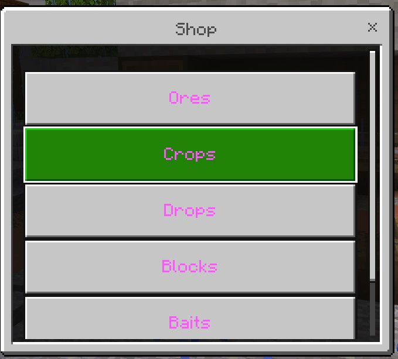
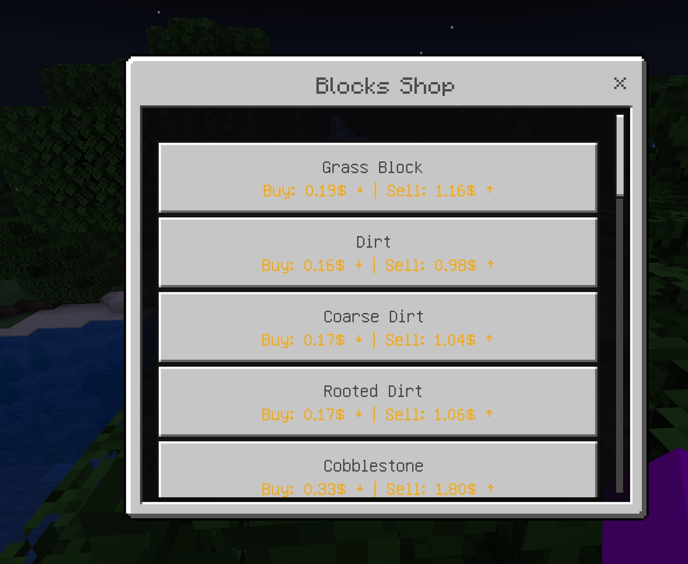

# 🛏️ 基岩版菜单 - 仅付费版

## 使用需求

* 需要在你的**Spigot 子服**中同时安装 Geyser 和 Floodgate。若你正在使用 BungeeCord 群组，则你需要同时在代理端和子服中同时安装。
* 你必须将 Geyser 中的 `auth-type` 设置为 **`floodgate`**。
* 如果你正在使用 BungeeCord，你需要在后端服务器中按照[这些步骤](https://wiki.geysermc.org/floodgate/setup/)谨慎安装。

::: info

若你的服务器已经正确安装并配置了 Floodgate，控制台会在 UltimateShop 加载时输出 `已挂钩 Floodgate（Hooking into Floodgate）`的消息。若这个消息没有出现但你坚信你的服务器安装了 Floodgate，这很有可能是你下载了插件的免费版本。<font color="red">**付费版本**</font>才会在启动时输出这条消息。

:::

* 所有基岩版玩家都会使用全新的界面。如果没有，你可以尝试将 `config.y,ml` 中的 `menu.bedrock.check-method` 选项从 **FLOODGATE** 切换为 **UUID**。
* 基岩版界面会自动生成，无需任何手动配置。



## 基岩版按钮的额外设置

若你想要修改这些基岩版按钮的样式，你需要在按钮或物品的 `display-item` 部分下添加 `bedrock` 配置，如下所示：

``` YAML
  A:
    display-item:
      material: GRASS_BLOCK
      bedrock:
        hide: false
        icon: 'url;;https://raw.githubusercontent.com/Jens-Co/MinecraftItemImages/main/1.20/melon_slice.png'
```

或是

``` YAML
  B: 
    display-item:
      1:
        material: GRASS_BLOCK
        bedrock:
          hide: false
          icon: 'url;;https://raw.githubusercontent.com/Jens-Co/MinecraftItemImages/main/1.20/melon_slice.png'
    display-item-conditions:
      1:
        type: permission
        permission: 'test'
```

如果你的物品配置没有 `display-item` 部分，你可以直接在物品配置下添加 `bedrock` 部分，或者直接在单物品部分添加它们，如下所示：

``` YAML
  D:
    price-mode: ANY
    product-mode: CLASSIC_ALL
    # Plan A
    bedrock:
      hide: false
      icon: 'url;;https://raw.githubusercontent.com/Jens-Co/MinecraftItemImages/main/1.20/melon_slice.png'
    products:
      1:
        material: melon_slice
        amount: 1
        # 另一种实现方式
        bedrock:
          hide: false
          icon: 'url;;https://raw.githubusercontent.com/Jens-Co/MinecraftItemImages/main/1.20/melon_slice.png'
    buy-prices:
      5:
        economy-type: exp
        amount: 2
        placeholder: '&6{amount} 经验值'
        start-apply: 0  
      2:
        economy-type: levels
        amount: 5
        placeholder: '&6{amount} 经验等级'
        start-apply: 0 
    sell-prices:
      1:
        economy-plugin: Vault
        amount: 1
        placeholder: '&6{amount} 硬币'
        start-apply: 0
    sell-limits:
      global: 640
      default: 128
      vip: 192
    sell-limits-conditions:
      vip:
        - 'permission: group.vip'
    sell-limits-reset-mode: 'TIMED'
    sell-limits-reset-time: '00:00:00'  
```

当前版本支持填入如下内容：

* `icon`：按钮的图标。格式为 `路径;;<图片路径或网址>;;<图片网址>`。图片的路径为基岩版图片路径，而非插件路径。如：`path;;textures/blocks/stone_granite.png`。如果你不知道这是什么，请你无视，也请你别来问我。

示例：


在物品配置中（菜单配置与其相似）：

* `hide`：是否对基岩版玩家隐藏此按钮。
* `extra-line`：显示按钮的第二行文本，支持填入 `{buy-price}` 与 `{sell-price}` 变量显示物品价格。

## 基岩版菜单的额外设置

你可以在菜单设置中添加这些额外选项。如下所示：

``` YAML
title: '{shop-name}'
size: 54

# 添加的内容
bedrock:
  enabled: true
  content: 'test'

open-actions:
  - 'sound: item.book.page_turn;;1;;1'
```

* `enabled`：是否为基岩版玩家自动打开基岩版表单界面。只对普通类型的菜单有效。其他如商店菜单、增量购买菜单与全部出售菜单无效。若你想要对所有菜单禁用该功能，`config.yml` 中有一个叫 `menu.bedrock.enabled` 的选项。
* `content`：基岩版菜单的标题内容。只对普通类型的菜单有效。其他如商店菜单、增量购买菜单与全部出售菜单无效。

## 价格额外一行显示

你可以在 `config.yml` 文件中启用价格显示在额外一行中的功能。在启用后，所有价格按钮都会在第二行显示其价格。可将设置留空禁用此功能。

``` YAML
  # 仅付费版
  bedrock:
    # 留空表示禁用.
    price-extra-line:
      default: '&6买价: {buy-price} &6| 卖价: {sell-price}'
      only-buy: '&6买价: {buy-price}'
      only-sell: '&6卖价: {sell-price}'
```

