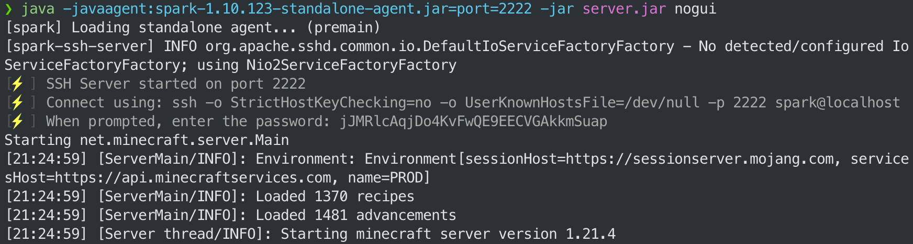
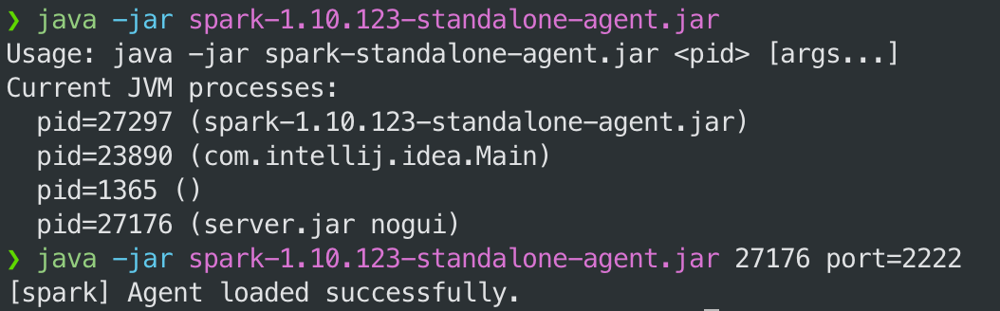
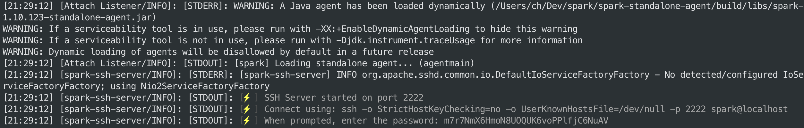
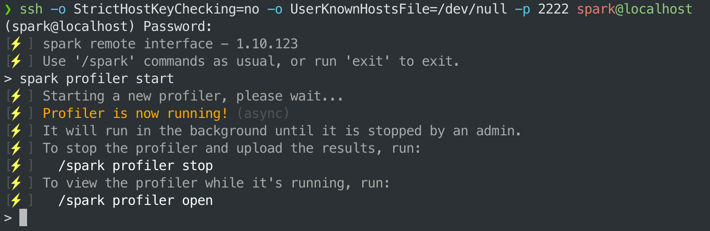

# 独立代理

除了在服务器、客户端或群组上以插件/模组方式运行外，spark 也支持为任意运行于 Java 虚拟机（JVM）上的应用进行性能侧写。如，网站应用、Discord 机器人或其他使用 Java、Kotlin、Scala 编写的应用等。

这是通过将 spark 以“Java 代理”的形式应用于 JVM 的。

::: tip

这个方法也适用于未安装模组加载器的“原版”Minecraft 客户端或服务器，它本身就是一个 Java 应用！如下的示例会详细讲述。

spark 还对原版的服务器有额外兼容，在为原版服务器进行性能侧写时会自动反混淆映射。

:::

## 安装（启动时应用）

从[下载页](https://spark.lucko.me/download)获取 spark 独立版本的 jar 文件。

之后，在启动程序时，将如下 `-javaagent` 端的参数加入命令。

例如：

``` bash
java -javaagent:spark-x.y.z-standalone-agent.jar -jar application.jar [应用参数]
```

你也可以通过 `port` 参数指定代理监听的端口号，如：

``` bash
java -javaagent:spark-x.y.z-standalone-agent.jar=port=2222 -jar application.jar [应用参数]
```



## 安装（运行时应用）

若要将 spark 独立代理应用至正在运行中的 Java 应用，你可以执行如下命令：

``` bash
# 将 <进程ID> 替换为正在运行的 Java 应用进程 ID
java -jar spark-x.y.z-standalone-agent.jar <pid>

# 或者指定端口号
java -jar spark-x.y.z-standalone-agent.jar <pid> port=2222
```

如果你运行 jar 的时候没有指定进程 ID，它会显示所有运行的 Java 程序及其进程 ID。



在代理应用完毕后，连接操作步骤会显示在程序本身的控制台/日志中。



## 用法（SSH 界面）

在代理添加完毕后，你可以通过特殊的 SSH 界面与其交互。在代理启动时，它会在控制台/日志输出中显示连接操作步骤。

只需简单地将 SSH 命令复制到新打开的终端界面并输入密码即可。



在 SSH 界面中，你可以使用一般的 [spark 命令](spark.command-usage.md)，以及特殊的 `exit` 命令，用于退出界面。

## 代理参数

在添加代理时，你可以指定如下参数：

* `port={端口号}` - 指定代理监听的端口号。默认为 `2222`。
* `start` - 若存在，代理在连接成功后便会立即开始性能侧写。
* `open` - 若存在，代理在连接成功后会在控制台/日志中显示报告连接。

可使用英文逗号 `,` 指定多个参数。如：

``` bash
java -javaagent:spark-x.y.z-standalone-agent.jar=port=2222,start,open -jar application.jar
```